```{r setup, include=FALSE}
knitr::opts_chunk$set(echo = TRUE)
library(tinytex)
```

\newpage

## Introduction

An escalation of armed conflict in new areas, along with the COVID-19 crisis that has severely hit the country, people in Myanmar have had difficulty coping and food insecurity is rising. Poverty has reached levels not seen since 2005 ^[UNDP. Impact of twin crises on human welfare in Myanmar, October 2021]. 

From a Food Security perspective there are key elements to be considered in the design of Food Security strategies.

## 1. Conflict dynamic in Myanmar

### 1.1 Comparing the conflict in Myanmar with other conflicts

According to Armed Conflict Location and Event Data Project (ACLED), Myanmar had the highest number of conflict events in 2021 out of any country. The graph below shows the yearly trends of the top 10 countries by number of conflict events (excluding peaceful protests). In 2021, more conflict events were recorded in Myanmar than in Syria. Though it might be superseded by the Russia-Ukraine war in 2022, Myanmar remains one of the world’s most critical conflict hotspots. 

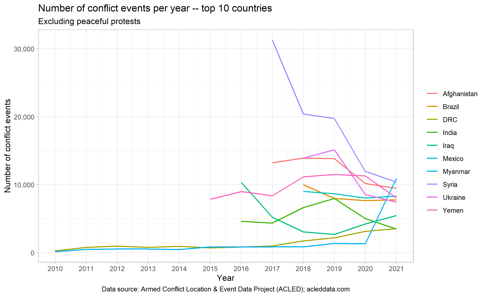

<br>
<br>

\newpage

### 1.2 Evolution of the conflict^[Food Security Cluster. Understanding Conflict Dynamics in Myanmar: A Food Security Perspective. https://food-security-cluster-myanmar.github.io/exploratory-data-analysis-acled-fsc/]

The map below shows the six most common conflict interaction types. Of these, four involve the Military. The most fatal interactions in Myanmar 

Each point on the map below (GIF available [here](https://food-security-cluster-myanmar.github.io/exploratory-data-analysis-acled-fsc/#progression-of-conflict-events-by-interaction-type-in-2021)) indicates a conflict interaction, classified by colour depending on the actors involved. The six most common interaction types have been included, with all the less frequent ones being recoded as “other”. The number of fatalities associated with each event is indicated by the size of the point.

The interactions that resulted in the most fatalities were between the military and political militia (57% of fatalities), followed by military versus rebel interactions (19%), military versus civilians (9%) and political militia versus civilians (8%). An alternative map, showing the progression of the conflict in 2021 by event type is shown in section 3.5.

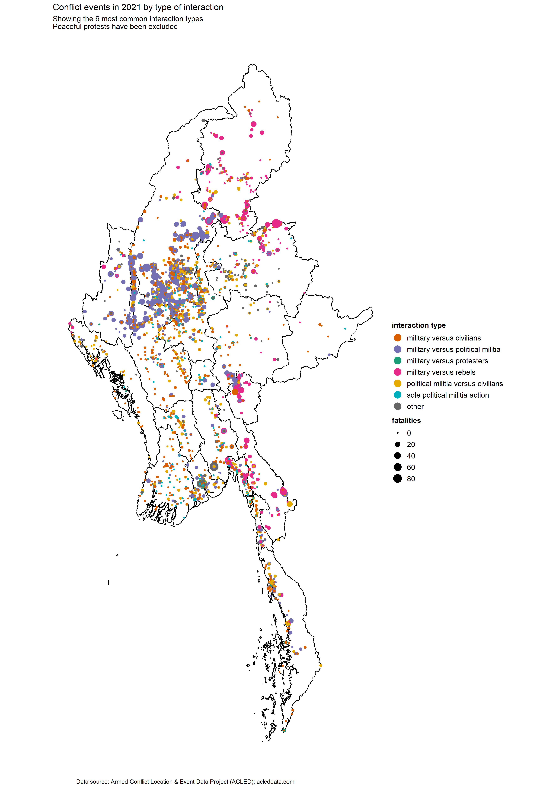

<br>
<br>
<br>

### 1.3 Crop production challenges 

**49.6%** of crop producers faced difficulty in crop production. 

* 24% of crop producers reduced the area planted (compared to other typical years).

* 18% of crop producers expect a reduction in harvest . 

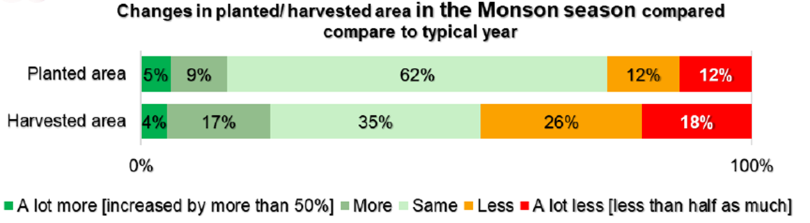

By type of crop: 

* Beans and pulses were the most-affected crops in terms of area and production decreases. 

* Paddy rice farmers were particularly hard hit, 12% cited planting much less compared to a typical year and 17% harvested significantly less rice. 

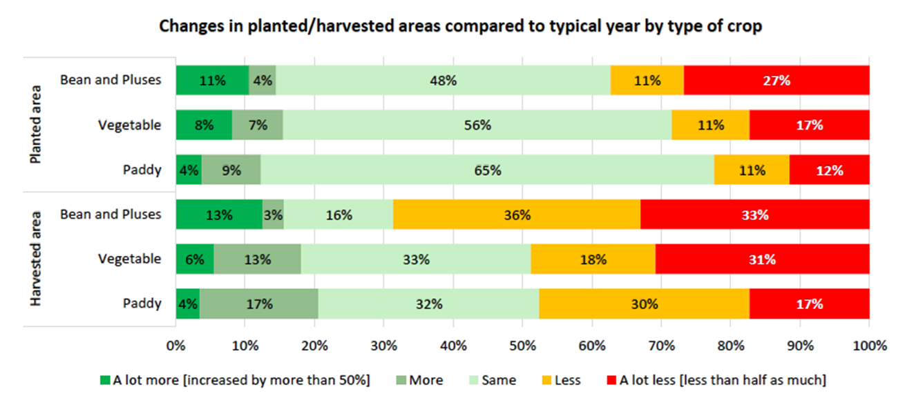
<br>
<br>
<br>

\newpage

## 2. Rapidly growing food security crisis

<br>

Overall, there was little change in crisis and emergency coping mechanisms in 2021 compared to 2020. 

* Stress coping (33%) was higher in 2021 compared to 2020 (23%), with greater increases in urban areas (21%-2020/36%-2021) compared to rural areas (25%-2020/32%-2021).

* In 2021, households tended to borrow money or spend savings, indicating a reduced ability to deal with future shocks due to reduced resources or increased debts.

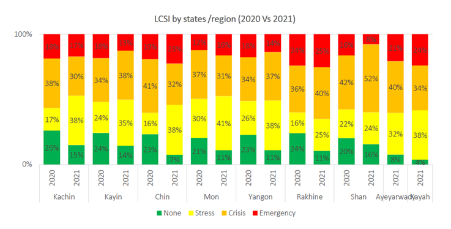

<br>

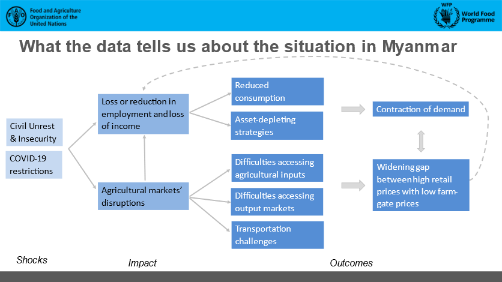

<br>
<br>
<br>

\newpage 

## 3. Challenges in delivery food security assistance to the most vulnerable people

### 3.1 Spatial distribution of food security partners vs. spatal distribution of food security needs

Food Security Cluster partners are not well-positioned to cover the 2022 population in terms of needs and targets. Partners are largely concentrated in Kachin, Rakhine and Yangon, with only one partner present in Shan (East) and two in Tanintharyi.

Overall, 57% of townships, containing 48% of the 2022 target, do not have any partners present. This lack of nationwide coverage will be one of the most important constraints that the FSC will face in meeting the 2022 needs of vulnerable, food insecure persons, including IDPs. Resolving this will require increasing partner coverage, finding new partners for the cluster, and securing sufficient funding.

<br>

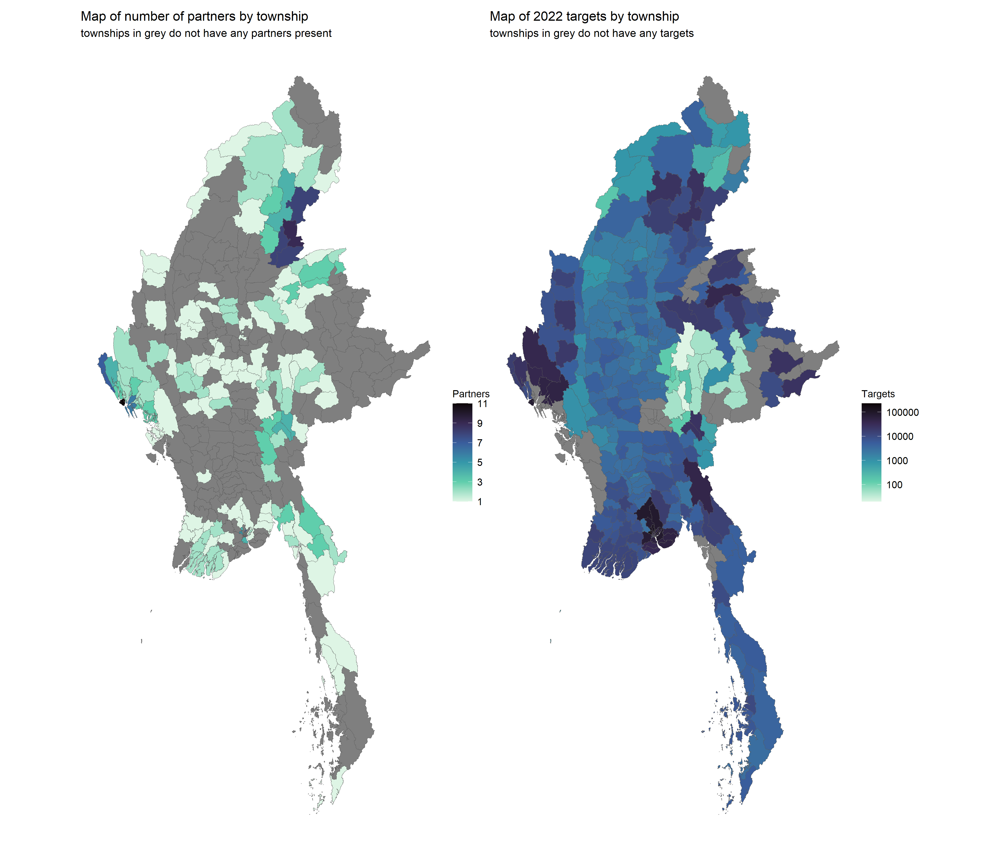

<br>
<br>

### 3.2 Food Security Cluster partner footprint

Whilst there is quite a bit of variation in the number of beneficiaries reached, the geographic spread of FSC’s partners is quite limited. Only 8 partners have a presence in more than 10 townships, and only 13 are present in more than 5 townships. 78% of FSC partners (clustered along the bottom of the chart) are present in 5 townships or less. This distribution of partners is an impediment to a countrywide response and it is imperative to understand how:

* To incentivise partners to expand their footprints

* FSC can identify new partners to reach vulnerable persons in areas recently affected by conflict

* To encourage donors to support the expansion of Food Security activities in areas recently affected by conflict (with sufficient support costs)

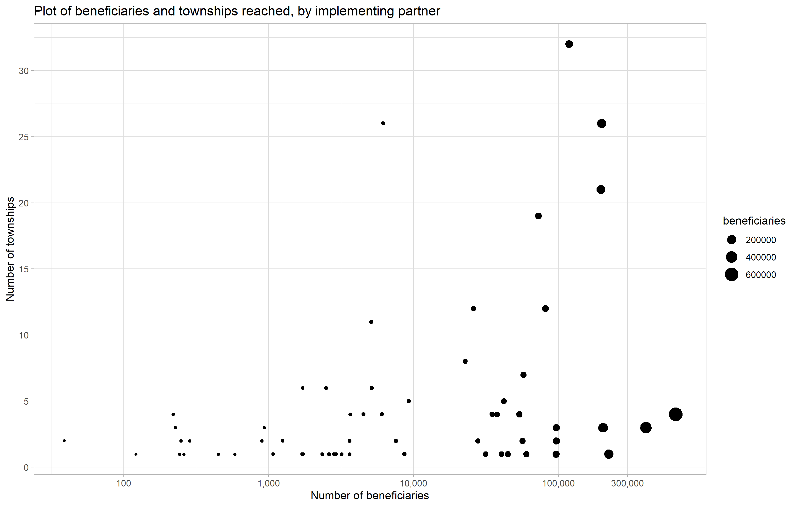

In terms of activities, 37 partners (60% of partners reporting in 5Ws) are implementing only one type of activity. Only one partner is responding across 6 activities. This indicates that the food security support provided to beneficiaries is far from comprehensive and does not help beneficiaries achieve sustainable and clear positive food security status.

<br>
<br>

### 3.3 Provision of food security assistance vs conflict dynamic

There is a significant lack of partners in the parts of the country most affected by conflict, especially around Sagaing and Magway. Conflict, explosions and violence was most prevalent in Sagaing, and, to lesser extents Kachin and Shan North. This presents a very clear picture that humanitarian partners, who have traditionally focused on Rakhine, Kachin and northern Shan, have not allocated their resources in line with populations affected by conflict. Though the extent to which such decisions were influenced by OCHA’s focus on peri-urban areas in the Interim Emergency Response Plan (IERP) is unclear.

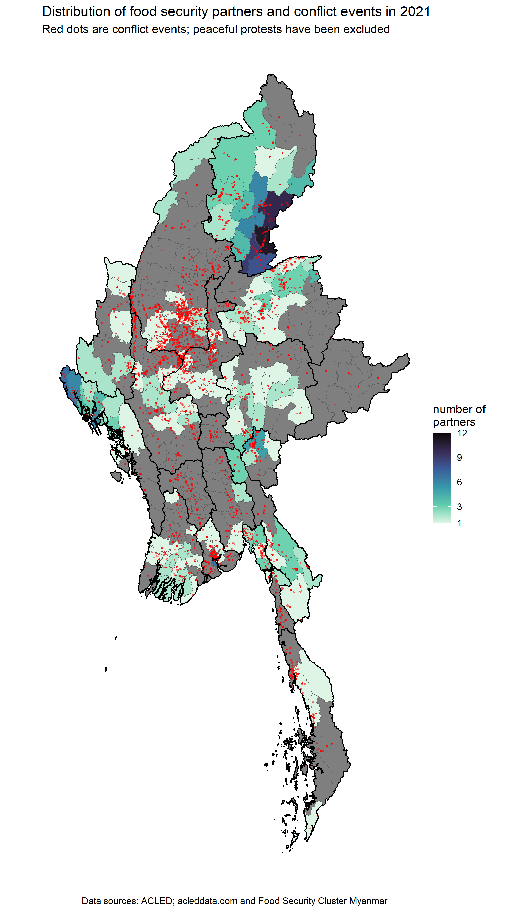

<br>
<br>

### 3.4 Agricultural production vs conflict dyanmic

<br>

The last year in which detailed township-level agricultural statistics were made available was 2016, these were included in the MIMU-HARP report Vulnerability in Myanmar. It is also important to note that the main reason these statistics were released was due to the development of the 2015/2016 National Recovery Framework and Plan for Floods and Landslides, meaning that some of the values, especially those related to area harvested, are anomalous. However, agricultural areas sown are unlikely to have shifted greatly in the past 6 years  – indeed, the area of sown paddy fields has only varied by 0.1% between 2015/2016 and 2018/2019 when being compared at the national level.

<br>

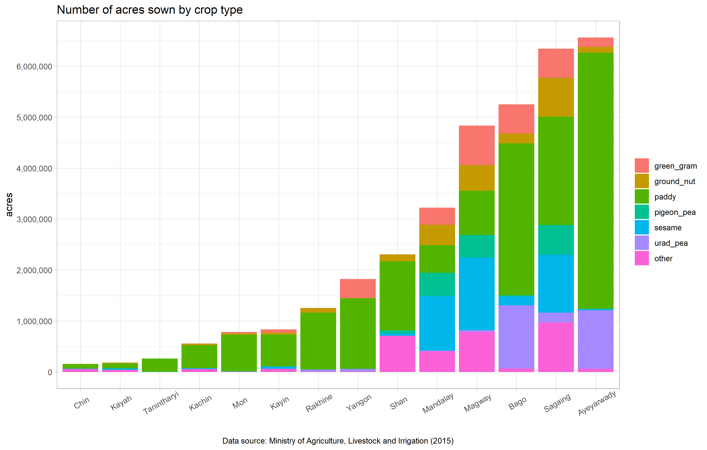

Although the 2015/2016 agricultural data was released to document the losses from floods and landslides, much can still be gleaned from aggregating the data. With reference to the table below, it is very important to note that the net margins per acre were lowest for paddy fields, meaning that areas with greater levels of crop diversification will suffer greater economic impacts from conflict events. Only general trends can be gleaned from the net margins of crops as 2015/2016 were anomalous due to widespread flooding and landslides. But assuming these margins are still accurate, areas of Myanmar with greater levels of crop diversification, such as Mandalay, Magway and Sagaing, have likely suffered greater economic impacts from conflict events.

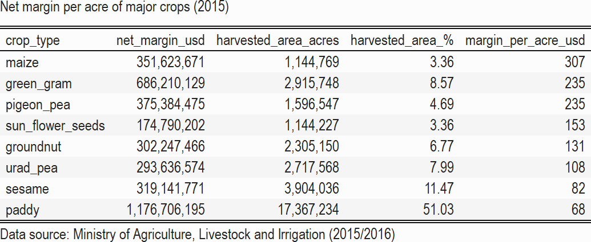{ width=80% }


### 3.5 Impact of conflict on price

<br>

Conflict has a real effect on food prices, as demonstrated by the International Food Policy Research Institute (IFPRI) in their working paper Agricultural value chains in a fragile state: the case of rice in Myanmar. IFPRI noted that while neither paddy nor milled rice had seen any major price changes after the coup, the retail price of rice has been noticeably higher since the coup. This is in line with a steep increase in food vendors experiencing “local farmer supply difficulties” and “outside village supply difficulties”, among those surveyed.

All this indicates that the conflict has been impacting agricultural supply chains and prices – an 11% increase in the retail prices of rice were noted after the coup. IFPRI noted that “an additional 10 violent events in the month-of and month before price measurement was associated with a 1 and 2 percent increase in price dispersion at the mill and vendor levels […] the impact of 10 violent events is approximately equivalent to a 167-333 km of distance between mills and vendors”.

To ensure food security in Sagaing, Magway, Mandalay, Mon, Kayin, Kachin and Kayah, livelihood programming should be predicated on safe access to agricultural land and markets. A more thorough analysis of market access in these areas is warranted; facilitating access between producers, millers and vendors in these areas will contribute to the stabilisation of prices. There is also the necessity for mine-risk education as many areas might be contaminated by UXOs. 

The map below shows 2021 conflict events by **month**. The colour of each point indicates the type of conflict event. The number of fatalities associated with each event is indicated by the size of each point.(GIF available [here](https://food-security-cluster-myanmar.github.io/exploratory-data-analysis-acled-fsc/#progression-of-hte-conflict-in-2021-by-event-type)).

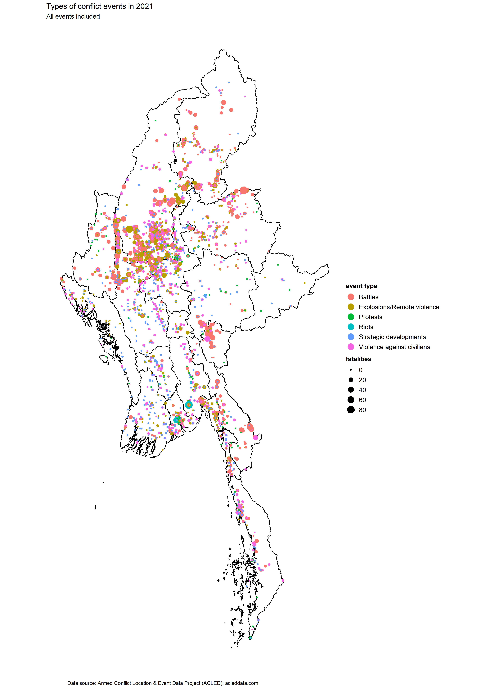

Agricultural areas in Ayeyarwady, Bago, Yangon, Rakhine and Shan (East) have been less affected by conflict events and fatalities, indicating that access to fields and markets has not been disrupted and existing livelihood programme designs may be sufficient in these areas.

The following maps highlight where the conflict most affects agricultural food production.

<br>

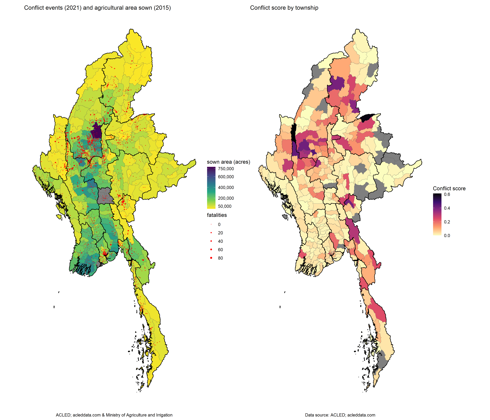

<br>
<br>
<br>

## 4. Importance of supporting agriculture/livelihoods programming

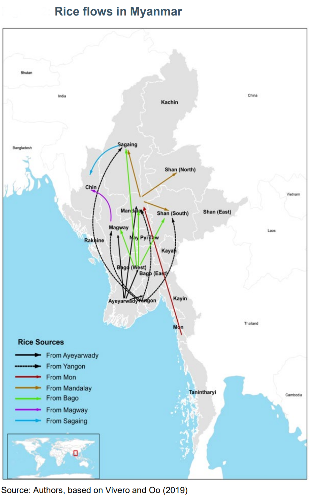^[IFPRI. Agricultural value chains in a fragile state: the case of rice in Myanmar]

As presented in IFPRI, data from the 2017 national Myanmar Livelihood and Consumption Survey (MLCS) showed that 60% of farm households nationwide grew paddy rice during the monsoon season (the major agricultural season). However, some areas are better suited to commercial rice production and the major rice production areas are mostly situated in the southwest of the country. The regions of Bago, Yangon, and Ayeyarwady collectively account for 45% of the monsoon rice produced in Myanmar (Goeb et al. 2021).

As highlighted earlier, Ayeyarwady, Sagaing, Bago and Magway are the key food baskets of Myanmar. Severe disruption of food production may significantly affect people’s food security status, leading them to rely more heavily on negative coping strategies.

Analysis of FSC’s achievements in 2021 shows that 2.8M people benefited from emergency relief assistance against 520,000 benefiting from agricultural/livelihoods support^[Food Security Cluster. Initial Observations on the 2021 Myanmar Food Security Cluster 5Ws. https://food-security-cluster-myanmar.github.io/mmr_5w_initial_observations/.].

<br>
<br>
<br>

## 5. Conclusions^[WFP, FAO. Preliminary findings WFP-FAO, October 2021. Food Security Cluster. Understanding Conflict Dynamics in Myanmar: A Food Security Perspective. https://food-security-cluster-myanmar.github.io/exploratory-data-analysis-acled-fsc/. Food Security Cluster. Initial Observations on the 2021 Myanmar Food Security Cluster 5Ws. https://food-security-cluster-myanmar.github.io/mmr_5w_initial_observations/.]

* Civil unrest and COVID-19 have **resulted in employment and income losses**;

* Difficulties in agricultural production, particularly for access to inputs and labour, led to a **retrenchment of areas planted**;

* Agricultural supply markets facing disruptions contributed to **high retail prices and low farm-gate prices**;

* Increased reliance on **negative coping strategies depleted livelihood assets**;

* Households' **access to food was reduced** (physically in areas of conflict and insecurity, and financially due to lost income and high food prices) resulting in worsening food consumption compared to last year;

* **Deterioration in overall food insecurity compared** to last year, with the highest prevalence (within the areas surveyed) of food insecurity found in Chin, Rakhine and Kayah. 

* Efforts have to made to **reach vulnerable people in conflict-affected areas**, or in new displacement areas, including from donors. 

<br>
<br>
<br>

## 6. Food security assistance to be provided^[WFP, FAO. Preliminary findings WFP-FAO October 2021.]

* Humanitarian assistance will be required to address food consumption gaps for the most vulnerable households, particulary:
  + In the most conflict affected states/regions, for newly displaced people and for communities who lost access to their livelihoods and/or who do not have access to markets due to conflict 
  + Long-term IDPs
  + The urban poor, particularly residents of informal settlements
  
<br>
  
* Emergency agriculture support to recover vital crop and livestock production, to rebuild assets, improve access to agricultural inputs given the scale of the deterioration of food insecurity and the economic shock. 
  + In the most conflict affected states/regions, for newly displaced people and for communities who lost access to their livelihoods and/or who do not have access to markets due to conflict
  + The urban and peri urban poor, particularly residents of informal settlements 


