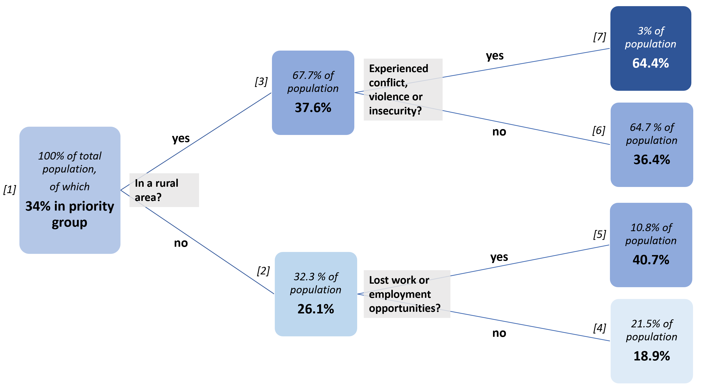

```{css, echo=FALSE}

#TOC::before {
  content: "";
  display: block;
  height: 70px;
  margin: 2em 20px 40px 20px;
  background-image: url("Myanmar_cluster_blue.png");
  background-size: contain;
  background-position: center center;
  background-repeat: no-repeat;
}
```

```{=html}
<style>
    body .main-container {
        max-width: 1280px;
    }
</style>
```


```{r setup, include=FALSE}
knitr::opts_chunk$set(echo = FALSE, fig.width=9, message = FALSE, warning=FALSE)
library(tidyverse)
library(readxl)
library(haven)
library(lubridate)
library(stringi)
library(pander)
library(janitor)
library(scales)
library(magrittr)
library(sf)
library(bookdown)
library(patchwork)
library(kableExtra)
library(DT)
library(viridis)
library(mdepriv)
library(psych)
library(widyr)
library(rpart)
library(rpart.utils)
library(rattle)
library(broomstick)
library(corrplot)
library(broom)
library(tidytext)
library(plotly)

library(RColorBrewer)

theme_set(theme_minimal())

# disabling scientific notation
options(scipen = 999)

# pander tables all in one row
panderOptions('table.split.table', Inf)

# pander thousands separator
panderOptions("big.mark", ",")

# replace 
opts <- options(knitr.kable.NA = "")

`%out%` <- Negate(`%in%`)

# function beneficiary summaries
sum_ben <- function(df, column_var){
  
  column_var <- enquo(column_var)
  
  df %>%
    group_by(!!column_var) %>% # must add bang-bang
    summarise(beneficiaries = sum(beneficiaries)) %>% 
    arrange(desc(beneficiaries))
    
}

# function beneficiary summaries, 2 grouped variables
sum_ben2 <- function(df, column_var1, column_var2){
  
  column_var1 <- enquo(column_var1)
  column_var2 <- enquo(column_var2)
  
  df %>%
    group_by(!!column_var1, !!column_var2) %>% # must add bang-bang
    summarise(beneficiaries = sum(beneficiaries)) %>% 
    arrange(desc(beneficiaries))
    
}

# scaling functions 
range01 <- function(x){(x-min(x))/(max(x)-min(x))}
range_wna <- function(x){(x-min(x, na.rm = TRUE))/(max(x, na.rm = TRUE)-min(x, na.rm = TRUE))}

#mode function 
mode <- function(x) {
  ux <- unique(x)
  ux[which.max(tabulate(match(x, ux)))]
}


# reading in PIN
pin <- read_excel("hpc_pin.xlsx")

# pcodes
pcodes <- read_excel("Myanmar PCodes Release_9.3_Jan2021_(StRgn_Dist_Tsp_Town_Ward_VT).xlsx",
                     sheet = "03_Township") %>%
  rename(admin1_pcode = SR_Pcode,
         state = SR_Name_Eng,
         admin3_pcode = Tsp_Pcode,
         township = Township_Name_Eng,
         admin2_pcode = `District/SAZ_Pcode`, 
         district = `District/SAZ_Name_Eng`)

# shapefiles
pcode3_shape <- st_read("./mmr_polbnda_adm3_mimu_250k/mmr_polbnda_adm3_mimu_250k.shp", 
                        quiet = TRUE) %>% 
 rename(state = ST, 
        admin1_pcode = ST_PCODE,
        township = TS,
        admin3_pcode = TS_PCODE) %>% 
 mutate(admin3_pcode = ifelse(str_detect(township, "Hlaingtharya"), "MMR013008", admin3_pcode))

pcode1_shape <- st_read("./mmr_polbnda2_adm1_mimu_250k/mmr_polbnda2_adm1_mimu_250k.shp", quiet = TRUE) %>% 
 rename(state = ST, 
        admin1_pcode = ST_PCODE) %>% st_as_sf()

# reading in 5Ws
fsc <- read_csv("fsc5w_2021.csv")

# reading in vulnerability dataset
vulmmr <- read_excel("Datasets_Vulnerability_Analysis_in_Myanmar_09Jul2018 (1).xlsx",
           skip = 1) %>% 
  slice(-c(1:3)) %>% 
  clean_names() %>% 
  select(-label) %>% 
  mutate_at(vars(number_of_village_tracts:wb_wealth_rank), as.numeric) %>% 
  mutate_at(vars(disasters_impacted_by_nargis_2008:acled_2015_2016_data_exists), as.logical) %>% 
  mutate_at(vars(conflict_2015_2016_number_of_battles:corrected_conflict_index_garry), as.numeric) %>% 
  select(-starts_with("x")) %>% 
  select(-c(private_sector_development_2014_2015, protection_2010_2015, shelter_2010_2015, wash_2010_2015))

# reading in conflict score
conflict_score <- read_csv("conflict_score2.csv")

# show_col(viridis_pal()(10))

floods_storm_surge <- read_excel("Flood_Affected_Township_(2008-2021) (1).xlsx") %>% 
  clean_names() %>% 
  rename(state = st, township = ts, admin1_pcode = st_pcode, admin3_pcode = ts_pcode) %>% 
  mutate(year_2008_storm_surge = ifelse(!is.na(storm_surg), 1, 0)) %>%
  mutate(year_2008 = ifelse(str_detect(flood_year, "2008"), 1, 0),
         year_2009 = ifelse(str_detect(flood_year, "2009"), 1, 0),
         year_2010 = ifelse(str_detect(flood_year, "2010"), 1, 0),
         year_2011 = ifelse(str_detect(flood_year, "2011"), 1, 0),
         year_2012 = ifelse(str_detect(flood_year, "2012"), 1, 0),
         year_2013 = ifelse(str_detect(flood_year, "2013"), 1, 0),
         year_2014 = ifelse(str_detect(flood_year, "2014"), 1, 0),
         year_2015 = ifelse(str_detect(flood_year, "2015"), 1, 0),
         year_2016 = ifelse(str_detect(flood_year, "2016"), 1, 0),
         year_2017 = ifelse(str_detect(flood_year, "2017"), 1, 0),
         year_2018 = ifelse(str_detect(flood_year, "2018"), 1, 0),
         year_2019 = ifelse(str_detect(flood_year, "2019"), 1, 0),
         year_2020 = ifelse(str_detect(flood_year, "2020"), 1, 0),
         year_2021 = ifelse(str_detect(flood_year, "2021"), 1, 0)) %>%
  rename(floodyears = flood_year) %>% 
  mutate(
    flood_prob = select(., starts_with("year_")) %>% rowMeans(na.rm = TRUE),
    flood_count = select(., starts_with("year_")) %>% rowSums(na.rm = TRUE))

# main dataset for this note
fs_pin <- pin %>% 
  left_join(conflict_score %>% select(admin3_pcode, battles, explosions_remote_violence, protests_and_riots, 
                                      strategic_developments, violence_against_civilians, 
                                      conflict_score = score_i, fatalities),
            by = "admin3_pcode") %>% 
  left_join(vulmmr %>% select(admin3_pcode = township_pcode, 
                     area_sown_acres = all_area_sowed_mali, population_density),
            by = "admin3_pcode") %>% 
  left_join(floods_storm_surge %>% 
              select(admin3_pcode, flood_prob, flood_count),
            by = "admin3_pcode") %>% 
  left_join(fsc %>%
              filter(unique_beneficiaries == "Yes") %>%
              group_by(admin3_pcode) %>%
              summarise(beneficiaries_2021 = sum(beneficiaries),
                        partners_2021 = n_distinct(org_code)),
            by = "admin3_pcode") %>% 
  left_join(fsc %>% filter(date > "2021-09-01") %>%
              group_by(admin3_pcode) %>%
              summarise(ben_6_months = sum(beneficiaries)),
            by = "admin3_pcode") %>% 
  mutate(not_in_6months = ifelse(is.na(ben_6_months), 1, 0)) %>% 
  mutate(fs_pin = ifelse(fs_pin > population_2021_proj, population_2021_proj, fs_pin)) %>% 
  replace_na(list(conflict_score = 0, beneficiaries_2021 = 0, partners_2021 = 0, flood_prob = 0)) %>% 
  mutate(conflict_ranking = dense_rank(desc(conflict_score)),
         flood_ranking = dense_rank(desc(flood_prob)),
         fs_pin_ranking = dense_rank(desc(fs_pin)),
         fs_target_ranking = dense_rank(desc(fs_targeted)),
         fs_pin_pc = fs_pin / sum(fs_pin),
         pin_pop = fs_pin / population_2021_proj) %>% 
  mutate(group = case_when(conflict_score >= mean(conflict_score) & population_density >= 1000 ~ "A1",
                           conflict_score >= mean(conflict_score) & population_density < 1000 ~ "A2",
                           conflict_score < mean(conflict_score) & population_density >= 1000 ~ "B1",
                           conflict_score < mean(conflict_score) & population_density < 1000 ~ "B2")) 

# fs_pin %>% write_csv("fs_pin.csv")

# should i just read in the whole survey dataset here? or just read in the csv
# i don't really know if people are interested in the cleaning process

fao_survey <- read_dta("MMR_R2HQ_cleanedWt_final.dta") %>% 
  zap_labels()

survey <- fao_survey %>% 
  rename(admin3_pcode = adm3_pcode) %>% 
  left_join(pcodes %>% select(admin3_pcode, township, state, admin1_pcode, district, admin2_pcode),
            by = "admin3_pcode") %>% 
  mutate_at(vars(cs_stress_hh_assets:cs_emergency_hh_risk), 
            ~case_when(. == 4 ~ NA_real_,
                       TRUE ~ .)) %>% 
  mutate_at(vars(cs_stress_hh_assets:cs_emergency_hh_risk), 
            ~case_when(. == 1 ~ 1,
                       . == 2 ~ 0, 
                       . == 1 ~ 1, 
                       TRUE ~ 0)) %>%
  mutate(lhcsi_max = case_when(lhcsi_max_ag == "None" ~ 0,
                                        lhcsi_max_ag == "Stress" ~ 1,
                                        lhcsi_max_ag == "Crisis" ~ 2,
                                        lhcsi_max_ag == "Emergency" ~ 3),
                  lhcsi_range = range01(lhcsi_max)) %>%
  mutate(csi_weighted = (cs_crisis_sold_prod_assets + cs_crisis_no_school + cs_crisis_reduced_health_exp) * 0.5 + 
           (cs_emergency_sold_house + cs_emergency_hh_migration + cs_emergency_hh_risk) * 1,
         csi_weighted = range_wna(csi_weighted)) %>% 
  mutate_at(vars(hh_gender, fewfood, skipped, whlday, hungry, ateless, healthy, runout, worried, 
                 crp_salesdif, accessmarket, need, crp_proddif, cropdifficultyunrest, cropsalesdifficultyunrest), 
            ~case_when(. == 3 ~ NA_real_, 
                       . == 4 ~ NA_real_, 
                       TRUE ~ .)) %>% 
  mutate(hoh_female = case_when(hh_gender == 1 ~ 0, 
                                hh_gender == 2 ~ 1,
                                TRUE ~ hh_gender)) %>%
  mutate_at(vars(fies_fewfood = fewfood, fies_skipped = skipped, 
                 fies_whlday = whlday, fies_hungry = hungry,
                 fies_ateless = ateless, fies_healthy = healthy,
                 fies_runout = runout, fies_worried = worried,
                 accessmarket, need, crp_salesdif, crp_proddif,
                 cropdifficultyunrest, cropsalesdifficultyunrest),
            ~case_when(. == 1 ~ 1, 
                       . == 2 ~ 0, 
                       TRUE ~ 0)) %>%
  mutate(no_accessmarket = ifelse(accessmarket == 1, 0, 1)) %>% 
  # be careful here -- you've imputed missing fies data as 0
  # this is the fies raw score, not sure if i need any additional transformations at the hhd level
  mutate(fies_raw = fies_fewfood + fies_skipped + fies_whlday + fies_hungry +
           fies_ateless + fies_healthy + fies_runout + fies_worried, 
         fies_raw_range = range_wna(fies_raw)) %>% 
  mutate_at(vars(hh_wealth_toilet, hh_residencetype, hh_education,
                 income_main_comp, income_sec_comp, income_third_comp, 
                 crp_area_change, crp_harv_change, crp_salesprice),
            ~case_when(. == 6 ~ NA_real_,
                       . == 7 ~ NA_real_, 
                       TRUE ~ .)) %>% 
  mutate_at(vars(income_main_comp, income_sec_comp, income_third_comp, 
                 crp_area_change, crp_harv_change, crp_salesprice),
            ~range_wna(.)) %>%   
  mutate(not_improved_sanitation = case_when(hh_wealth_toilet == 1 ~ 0,
                                                       hh_wealth_toilet == 2 ~ 0,
                                                       hh_wealth_toilet == 3 ~ 1,
                                                       hh_wealth_toilet == 4 ~ 1,
                                                       hh_wealth_toilet == 5 ~ 1)) %>% 
  mutate(residence_type = case_when(hh_residencetype == 1 ~ "residence_permanent",
                                    hh_residencetype == 2 ~ "residence_recent_migrant",
                                    hh_residencetype == 3 ~ "residence_returnee",
                                    hh_residencetype == 4 ~ "residence_idp",
                                    hh_residencetype == 5 ~ "residence_refugee",
                                  TRUE ~ NA_character_)) %>% 
  mutate(hoh_education = case_when(hh_education == 1 ~ "edu_none",
                                   hh_education == 2 ~ "edu_primary",
                                   hh_education == 3 ~ "edu_secondary",
                                   hh_education == 4 ~ "edu_higher",
                                   hh_education == 5 ~ "edu_religious",
                                   TRUE ~ NA_character_)) %>%
  mutate_at(vars(hh_age, incomechangereduced, wheremigration, meals, hh_agricactivity),
            ~case_when(. == 5 ~ NA_real_,
                       . == 6 ~ NA_real_,
                       TRUE ~ .)) %>% 
  mutate(hoh_age = case_when(hh_age == 1 ~ "age_under18",
                             hh_age == 2 ~ "age_18_40",
                             hh_age == 3 ~ "age_41_65",
                             hh_age == 4 ~ "age_over65",
                             TRUE ~ NA_character_)) %>% 
    mutate(meals_inv = case_when(meals == 4 ~ 1, 
                               meals == 3 ~ 2,
                               meals == 2 ~ 3, 
                               meals == 1 ~ 4,
                               TRUE ~ meals),
         meals_inv = range_wna(meals_inv)) %>% 
  mutate(income_reduced = case_when(incomechangereduced == 4 ~ 1,
                                    incomechangereduced == 3 ~ 2,
                                    incomechangereduced == 2 ~ 3, 
                                    incomechangereduced == 1 ~ 4,
                                    TRUE ~ incomechangereduced),
         income_reduced = range_wna(income_reduced)) %>% 
  # you've changed all the NAs in agriactivity to 0
  mutate(agri_activity = case_when(hh_agricactivity %in% c(1, 2, 3) ~ 1, 
                                       TRUE ~ 0)) %>%
  # fies indicators     
  mutate_at(vars(fies_ranout_hhs, fies_hungry_hhs, fies_whlday_hhs),
                ~case_when(. == 4 ~ NA_real_,
                           . == 5 ~ NA_real_,
                           TRUE ~ .)) %>% 
      mutate_at(vars(fies_hungry_hhs, fies_ranout_hhs, fies_whlday_hhs),
                ~case_when(. == 3 ~ 1, 
                           . == 2 ~ 0.5, 
                           . == 1 ~ 0.25, 
                           TRUE ~ .)) %>%
  mutate(expensefood30d = case_when(expensefood30d == 11 ~ NA_real_, 
                                        expensefood30d == 12 ~ NA_real_,
                                        TRUE ~ expensefood30d)) %>% 
      mutate(expense_food = expensefood30d / 10) %>%
      # fcs indicators
  mutate(hhfcs_inv = 112 - HHFCS,
         hhfcs_inv = range_wna(hhfcs_inv),
         fcs_borderline_poor = ifelse(HHFCS <= 35, 1, 0)) %>%
  mutate_at(vars(fcsstap, fcspulse, fcsdairy, fcspr, fcsveg, fcsfruit, fcsfat, fcssugar),
                ~ range_wna(7 - .)) %>%
  rename_with(str_replace, pattern = "fcs", replacement = "fcs_", matches("fcs")) %>%  
  rename(fcs_protein = fcs_pr, fcs_staple = fcs_stap, hhfcs_inv = hhfcs__inv, 
         fcs_borderline_poor = fcs__borderline_poor) %>% 
  mutate(income_source = case_when(income_main %in% c(1, 2, 3, 7, 8, 9, 10) ~ "income_ms_agriculture",
                                   income_main == 4 ~ "income_ms_livestock",
                                   income_main == 5 ~ "income_ms_fisheries",
                                   income_main %in% c(11, 13, 14) ~ "income_ms_stable_non_ag",
                                   income_main %in% c(6, 12) ~ "income_ms_casual_non_ag",
                                   income_main %in% c(15, 16, 17, 18) ~ "income_ms_selfem_nonwork",
                                   income_main %in% c(19, 20) ~ "income_ms_no_income", 
                                   TRUE ~ "income_ms_stable_non_ag")) %>%
  left_join(fao_survey %>% 
              mutate(income_source = case_when(income_main %in% c(1, 2, 3, 7, 8, 9, 10) ~ "income_ms_agriculture",
                                   income_main == 4 ~ "income_ms_livestock",
                                   income_main == 5 ~ "income_ms_fisheries",
                                   income_main %in% c(11, 13, 14) ~ "income_ms_stable_non_ag",
                                   income_main %in% c(6, 12) ~ "income_ms_casual_non_ag",
                                   income_main %in% c(15, 16, 17, 18) ~ "income_ms_selfem_nonwork",
                                   income_main %in% c(19, 20) ~ "income_ms_no_income", 
                                   TRUE ~ "income_ms_stable_non_ag")) %>%
              select(survey_id, income_source) %>%
              mutate(value = 1) %>%
              pivot_wider(names_from = income_source, values_from = value, values_fill = 0),
            by = "survey_id") %>% 
      # imputed income_main_group value -- look at the "maybe_later" below to see how it was done
      mutate(rural = ifelse(ruralurban == 1, 1, 0)) %>% 
      # imputed hoh sex -- mode
      mutate(hoh_female = ifelse(is.na(hoh_female), 0, hoh_female)) %>% 
      # imputed fies_ranout_hhs -- mode
      mutate(fies_ranout_hhs = ifelse(is.na(fies_ranout_hhs), 1, fies_ranout_hhs)) %>%  
  mutate(shocks_none = shock_noshock,
         shocks_lostwork = shock_lostemplorwork, 
         shocks_sicknessdeath = shock_sicknessordeathofhh, 
         shocks_foodprices = shock_higherfoodprices, 
         shocks_conflict = shock_violenceinsecconf, 
         shocks_cantworkbusiness = shock_cantworkordobusiness, 
         shocks_naturalhazard = ifelse(shock_flood > 0 | shock_drought > 0 | shock_hurricane > 0 | shock_landslides > 0 |
                                         shock_firenatural > 0 | shock_othernathazard > 0 |
                                         shock_coldtemporhail > 0, 1, 0),
         shocks_accessmarket = shock_napasture, 
         shocks_pricesother = ifelse(shock_higheragrinputprice > 0 | shock_higherfuelprices > 0 | 
                                       shock_othereconomicshock > 0 | shock_lowoutputprice > 0, 1, 0), 
         shocks_other = ifelse(shock_othercropandlivests > 0 | shock_otherintrahhshock > 0 | shock_othermanmadehazard > 0 |
                                 shock_animaldisease > 0 | shock_pestoutbreak > 0 | shock_plantdisease > 0 | 
                                 shock_othercropandlivests > 0 | shock_otherintrahhshock > 0 | shock_theftofprodassets > 0 , 
                               1, 0)) %>% 
  replace_na(list(income_main_amount = 0, income_sec_amount = 0, income_third_amount = 0)) %>% 
  mutate(income_total_amount = income_main_amount + income_sec_amount + income_third_amount,
         food_expenses_mmk = income_total_amount * expense_food, 
         income_per_capita = income_total_amount / hh_size) %>%
  mutate(needs_food = ifelse(need_food > 0, 1, 0),
         needs_cash = ifelse(need_cashassistance > 0, 1, 0),
         needs_medical = ifelse(need_medicalservicesupply > 0, 1, 0),
         needs_agri = ifelse(need_fertilizers > 0 | need_pesticides > 0 | need_techsupporextensionserv > 0 |
                               need_acstomechanisedequipprod > 0|
                               need_accesstoland > 0 | need_seeds > 0 | need_landrehabilitation > 0 | 
                               need_accesstoirrigationwater > 0 | need_supportforprocessprod > 0 |
                               need_agrilabour, 1, 0),
         needs_jobsloans = ifelse(need_loans > 0 | need_jobopportunity > 0, 1, 0),
         needs_other = ifelse(need_clothesshelterwater > 0 | need_educationassistance > 0 | need_fishequiorothersuppfor > 0 |
                                need_infoonsafetymeasures > 0 | need_marketingsupport > 0 | need_other > 0 |
                                need_storageequipmentorfaci > 0 | need_tools > 0 | 
                                need_restockinganimals > 0 | need_veterinaryservices > 0 | need_animalfeed > 0 |
                                need_animalsalemingarantdprice > 0 | need_supptransofanimalsorprod > 0 |
                                need_specialnutritionfood > 0, 1, 0)) %>% 
  replace_na(list(needs_food = 0, needs_cash = 0, needs_medical = 0, needs_agri = 0, 
                  needs_jobsloans = 0, needs_other = 0)) %>% 
  select(-c(shock_otherspecify, covid_otherspecify,shock_ref, covid_ref, shock_dk, covid_dk, 
            crp_proddif_otherspecify, crp_saledif_otherspecify, ls_num_inc_dec_otherspecify, 
            ls_food_supply_otherspecify, ls_proddif_otherspecify, need_dk, need_otherspecify,
            ls_salesdif_otherspecify, fish_saledif_otherspecify, reasonsmigration_otherspecify,
            adm3_ayeyarwady, adm3_chin, adm3_kachin, adm3_kayah, adm3_kayah, adm3_kayin,
            adm3_rakhine, adm3_shan_east, adm3_shan_north, adm3_yangon, adm3_mon)) %>%  
  mutate(food_expenses_per_capita = food_expenses_mmk / hh_size / 3, 
         meb_pc = food_expenses_per_capita / (190555 / 5)) %>% 
  
  mutate(agri_hhd = ifelse(income_ms_agriculture == 1 | income_ms_fisheries == 1 | income_ms_livestock == 1 |
                                      agri_activity == 1 | income_sec <= 10, 1, 0),
         agri_main = ifelse(income_ms_agriculture == 1 | income_ms_fisheries == 1 |
                              income_ms_fisheries == 1 | agri_activity == 1, 1, 0)) 

# fs_score mdepriv
fs_share <- survey %>%  
  select(survey_id, hhfcs_inv, fies_raw, csi_weighted) %>% 
  mutate_at(vars(hhfcs_inv, fies_raw, csi_weighted), scale) %>% 
  mutate_at(vars(hhfcs_inv, fies_raw, csi_weighted), range_wna) %>% 
  mdepriv(c("hhfcs_inv", "fies_raw", "csi_weighted"), method = "bv", output ="all")

# fs_score3 mdepriv
fs_share2 <- survey %>% 
  mutate_at(vars(cs_crisis_sold_prod_assets, cs_crisis_no_school, cs_crisis_reduced_health_exp), ~ . * 0.5) %>% 
  select(survey_id, fcs_staple, fcs_pulse, fcs_dairy, fcs_protein, fcs_veg, fcs_fruit, fcs_fat, fcs_sugar, 
         cs_crisis_sold_prod_assets, cs_crisis_no_school, cs_crisis_reduced_health_exp, 
         cs_emergency_sold_house, cs_emergency_hh_migration, cs_emergency_hh_risk,
         fies_fewfood, fies_skipped, fies_whlday, fies_hungry, fies_ateless, fies_healthy,
                 fies_runout, fies_worried) %>% 
  mdepriv(c("fcs_staple", "fcs_pulse", "fcs_dairy", "fcs_protein", "fcs_veg", "fcs_fruit", "fcs_fat", "fcs_sugar", 
         "cs_crisis_sold_prod_assets", "cs_crisis_no_school", "cs_crisis_reduced_health_exp", 
         "cs_emergency_sold_house", "cs_emergency_hh_migration", "cs_emergency_hh_risk",
         "fies_fewfood", "fies_skipped", "fies_whlday", "fies_hungry", "fies_ateless", "fies_healthy",
         "fies_runout", "fies_worried"), output = "all")

fs_share3 <- survey %>% 
  mutate_at(vars(cs_crisis_sold_prod_assets, cs_crisis_no_school, cs_crisis_reduced_health_exp), ~ . * 0.5) %>% 
  select(survey_id, fcs_staple, fcs_pulse, fcs_dairy, fcs_protein, fcs_veg, fcs_fruit, fcs_fat, fcs_sugar, 
         cs_crisis_sold_prod_assets, cs_crisis_no_school, cs_crisis_reduced_health_exp, 
         cs_emergency_sold_house, cs_emergency_hh_migration, cs_emergency_hh_risk,
         fies_fewfood, fies_skipped, fies_whlday, fies_hungry, fies_ateless, fies_healthy,
                 fies_runout, fies_worried, combined_wt) %>% 
  mdepriv(c("fcs_staple", "fcs_pulse", "fcs_dairy", "fcs_protein", "fcs_veg", "fcs_fruit", "fcs_fat", "fcs_sugar", 
         "cs_crisis_sold_prod_assets", "cs_crisis_no_school", "cs_crisis_reduced_health_exp", 
         "cs_emergency_sold_house", "cs_emergency_hh_migration", "cs_emergency_hh_risk",
         "fies_fewfood", "fies_skipped", "fies_whlday", "fies_hungry", "fies_ateless", "fies_healthy",
         "fies_runout", "fies_worried"), output = "all", sampling_weights = "combined_wt")

fs_share4 <- survey %>% 
  mutate_at(vars(cs_crisis_sold_prod_assets, cs_crisis_no_school, cs_crisis_reduced_health_exp), ~ . * 0.5) %>% 
  select(survey_id, hhfcs_inv, 
         cs_crisis_sold_prod_assets, cs_crisis_no_school, cs_crisis_reduced_health_exp, 
         cs_emergency_sold_house, cs_emergency_hh_migration, cs_emergency_hh_risk,
         fies_fewfood, fies_skipped, fies_whlday, fies_hungry, fies_ateless, fies_healthy,
                 fies_runout, fies_worried, combined_wt) %>% 
  mdepriv(c("hhfcs_inv", 
         "cs_crisis_sold_prod_assets", "cs_crisis_no_school", "cs_crisis_reduced_health_exp", 
         "cs_emergency_sold_house", "cs_emergency_hh_migration", "cs_emergency_hh_risk",
         "fies_fewfood", "fies_skipped", "fies_whlday", "fies_hungry", "fies_ateless", "fies_healthy",
         "fies_runout", "fies_worried"), output = "all", sampling_weights = "combined_wt")

# priority scores
survey <- survey %>%
  left_join(fs_share$data %>% 
              select(score_i, survey_id), by = "survey_id") %>% 
  left_join(fs_share2$data %>% 
              select(fs_score2 = score_i, survey_id), by = "survey_id") %>% 
  left_join(fs_share3$data %>% 
              select(fs_score3 = score_i, survey_id), by = "survey_id") %>% 
  left_join(fs_share4$data %>%  
              select(fs_score4 = score_i, survey_id), by = "survey_id") %>% 
   mutate(priority1 = case_when(hhfcs_inv >= mean(hhfcs_inv) & 
                                    fies_raw_range >= mean(fies_raw_range) & csi_weighted >= mean(csi_weighted) ~ 1,
                               TRUE ~ 0)) %>%
  mutate(priority2 = ifelse(score_i >= mean(score_i), 1, 0)) %>% 
  mutate(priority3 = case_when(hhfcs_inv >= mean(hhfcs_inv) & fies_raw_range >= mean(fies_raw_range) ~ 1, 
                               hhfcs_inv >= mean(hhfcs_inv) & csi_weighted >= mean(csi_weighted) ~ 1, 
                               fies_raw_range >= mean(fies_raw_range) & csi_weighted >= mean(csi_weighted) ~ 1, 
                               TRUE ~ 0)) %>% 
  mutate(priority = case_when(hhfcs_inv >= quantile(hhfcs_inv, probs = 0.75) & 
                                 fies_raw_range >= quantile(fies_raw_range, probs = 0.75) ~ 1, 
                               hhfcs_inv >= quantile(hhfcs_inv, probs = 0.75) & 
                                 csi_weighted >= quantile(csi_weighted, probs = 0.75) ~ 1,
                              fies_raw_range >= quantile(fies_raw_range, probs = 0.75) & 
                                 csi_weighted >= quantile(csi_weighted, probs = 0.75) ~ 1, 
                               TRUE ~ 0)) %>% 
  mutate(priority5 = case_when(hhfcs_inv >= quantile(hhfcs_inv, probs = 0.75) ~ 1, 
                               fies_raw_range >= quantile(fies_raw_range, probs = 0.75) ~ 1,
                               csi_weighted >= quantile(csi_weighted, probs = 0.75) ~ 1, 
                               TRUE ~ 0)) %>% 
  rename(fs_score = score_i)

# survey long

survey_long <- survey %>%
  select(survey_id, priority, fs_score, fs_score2, fs_score3, fs_score4, meb_pc, 
         contains("cs_"), contains("csi_"), contains("fies"), contains("fcs_"), contains("needs_"), 
         hhfcs_inv, need, 
         hoh_female, rural, expense_food, not_improved_sanitation, income_main_comp, agri_activity,
         lhcsi_max, lhcsi_range, accessmarket) %>% 
  select(-contains("wt"), -notefcs_, -lhcsi_max_ag) %>% 
  left_join(survey %>% select(survey_id, income_source, hoh_education, hoh_age, residence_type) %>% 
              pivot_longer(cols = -survey_id, names_to = "old_var", values_to = "var") %>%
              mutate(value = 1) %>% 
              select(-old_var) %>% 
              pivot_wider(names_from = var, values_from = value, values_fill = 0), by = "survey_id") %>%
  pivot_longer(cols = -survey_id, names_to = "var", values_to = "value") %>% 
  rbind(survey %>% select(contains("shocks_"), survey_id) %>%
          pivot_longer(cols = -survey_id, names_to = "var", values_to = "value"))

# 2022 Q1 5Ws
fsc <- read_csv("fsc_q1_2022.csv")

# ACLED dataset
acled <- read_csv("acled.csv") %>% 
  mutate(has_village = if_else(location != admin3, "yes", "no"))


# show_col(viridis_pal(option = "cividis")(10))
```


## Introduction 

Prioritisation can largely be broken into two steps -- geographic prioritisation and beneficiary selection. 

This document examines data from the FAO-WFP Shocks, Agricultural Livelihoods and Food Security Survey, the Armed Conflict Location and Event Dataset (ACLED) and the Myanmar Information Management Unit (MIMU). 

The first section deals with the development of core beneficiary selection criteria using the FAO-WFP survey data. The second section makes use of ACLED data for Myanmar to develop a conflict score for township prioritisation. Township and beneficiary selection criteria are linked by a decision tree. The third section presents flood risks by township -- these are only probabilities and serve as references for prepositioning and disaster risk reduction. They not included in the overall prioritisation process, though this might change if disasters occur. 

<br>

### References for this report
* ACLED (2022). ACLED data for Myanmar (2010-2022). https://acleddata.com.
* Maria Noel Pi Alperin, Philippe Van Kerm (2009). mdepriv: Synthetic indicators of multiple deprivation. Stata command. http://medim.ceps.lu/stata/mdepriv_v3.pdf
* Atillio Benini, Aldo Benini (2021). mdepriv: Synthetic scores of multiple deprivation. R package version 0.0.3.  https://github.com/a-benini/mdepriv/.
* Gianni Betti, Vijay Verma (2004). A methodology for the study of multi-dimensional and longitudinal aspects of poverty and deprivation. Dipartamento di Metodi Quantitativi, Universita di Siena. http://repec.deps.unisi.it/quaderni/49DMQ.pdf. 
* FAO and WFP (2022). Myanmar | Shocks, agricultural livelihoods and food security: Monitoring report, March 2022. Rome. 
* Food Security Cluster, Myanmar (2021). 5Ws reporting tool.
* Food Security Cluster, Myanmar (2022). Understanding Conflict Dynamics in Myanmar through Conflict and Incident Data: A Food Security Perspective. https://food-security-cluster-myanmar.github.io/exploratory-data-analysis-acled-fsc/.
* HARP-F and MIMU (2018). Vulnerability in Myanmar: A Secondary Data Review of Needs, Coverage and Gaps. http://themimu.info/vulnerability-in-myanmar.
* IFPRI (2022). Household Welfare in Myanmar: Results from the Myanmar Household Welfare Survey

<br><br><br>

## 1. Beneficiary Selection using FAO-WFP survey data


A total of `r nrow(survey) %>% format(big.mark = ",")` households were interviewed in the FAO-WFP Shocks, Agricultural Livelihoods and Food Security Survey in Ayeyarwady, Chin, Kachin, Kayah, Kayin, Mon, Rakhine, Shan and Yangon to monitor food security and livelihoods of persons in Myanmar. Some of the most key data collected were on the various food security indices -- the Food Consumption Score (FCS), the Food Insecurity Experience Scale (FIES) and the Livelihood Coping Strategies Index (CSI). Much more detail can be gleaned from the report itself -- this document focuses only on the aspects of the survey which can be used for prioritisation.

A composite of the three indices, the Food Insecurity Score has also been calculated. Information was also collected on basic household demographics as well on income sources. The construction of this composite score is detailed in section 4.2. 

<br><br>

### 1.1 An overview of the food security indicators

The plot below ranks variables in order of their ability to predict the various food insecurity composite indices. Only environmental or demographic variables were taken into account as it would be redundant to predict food security indices using the components of said indices. Only responses that occurred more than 200 times (out of 2,708) in the survey were considered. 

Variables that are more red are most likely to result in high food insecurity scores (that is, higher food insecurity) and variables that are more blue are more likely to result in lower food insecurity scores. The dotted red line down the middle at $x=0$ splits variables into whether the predict higher food insecurity (positive numbers) or lower food insecurity (negative numbers). 

For all these plots, the scores of the food security indices have all been scaled between 0 and 1, with higher scores indicating greater food insecurity. The coefficient estimates below show how much a positive response on these variables would increase or decrease the score on each of the indices. 

<br>

```{r coefficient-plot-priority, fig.height=8}
lm_prep_long <- function(tbl) {
  tbl %>% 
    group_by(var) %>% 
  mutate(count = ifelse(value > 0, 1, 0),
         count = sum(count, na.rm = TRUE)) %>% 
  ungroup() %>% 
  filter(count > 200) %>% # adjust the threshold n
  select(-count) %>% 
  pivot_wider(names_from = var, values_from = value, values_fn = max) %>% 
  select(-survey_id, -shocks_none)
}

plot_coef <- function(tbl) {
  tbl %>%  
    tidy(conf.int = TRUE) %>%
    filter(term != "(Intercept)") %>% 
    mutate(term = str_replace(term, "income_ms", "income_source"),
           term = str_replace(term, "hoh_age", ""),
           term = str_replace(term, "hoh_education", ""), 
           term = fct_reorder(term, estimate)) %>% 
    ggplot(aes(x = estimate, y = term, colour = estimate)) + 
    geom_vline(xintercept = 0, lty = 2, colour = "red") +
    geom_point() + 
    geom_errorbarh(aes(xmin = conf.low, xmax = conf.high), height = 0.2) +
    scale_colour_viridis(option = "turbo") +
    theme(legend.position = "none",
          axis.text.y = element_text(size = 8.5),
          axis.title.x = element_text(size = 7, face = "bold"),
          plot.title = element_text(size = 9)) +
    labs(x = "Estimate", y = "")
}

survey_long %>%  
  filter(str_detect(var, "shocks_|hoh_|rural|expense_food|not_improved|agri_activity|income_ms_|edu_") |
           var %in% c("fs_score4", "expense_food")) %>% 
  lm_prep_long() %>% 
  mutate(fs_score4 = log(fs_score4)) %>% 
  mutate(fs_score4 = ifelse(is.infinite(fs_score4), 0, fs_score4)) %>% 
  lm(fs_score4 ~ ., data = .) %>% 
  plot_coef() + 
  labs(title = "Food insecurity score") + 
  
survey_long %>%
        filter(str_detect(var, "shocks_|hoh_|rural|expense_food|not_improved|agri_activity|income_ms_|edu_") |
         var %in% c("csi_weighted", "expense_food")) %>%
  lm_prep_long() %>%
  lm(csi_weighted ~ ., data = .) %>%
  plot_coef() + 
  labs(title = "Coping strategies index") + 
  
survey_long %>%
  filter(str_detect(var, "shocks_|hoh_|rural|expense_food|not_improved|agri_activity|income_ms_|edu_") |
           var %in% c("hhfcs_inv", "expense_food")) %>%
  lm_prep_long() %>%
  lm(hhfcs_inv ~ ., data = .) %>%
  plot_coef() + 
  labs(title = "Food consumption score") + 

survey_long %>%
  filter(str_detect(var, "shocks_|hoh_|rural|expense_food|not_improved|agri_activity|income_ms_|edu_") |
           var %in% c("fies_raw_range", "expense_food")) %>%
  lm_prep_long() %>%
  lm(fies_raw_range ~ ., data = .) %>%
  plot_coef() + 
  labs(title = "Food insecurity experience scale")
```

<br>

The variables that tendo to contribute the most to high food insecurity scores are a household's exposure to conflict, whether or not they lost employment or work opportunities, whether or not they were engaged in casual non-agricultural labour and whether or not they reported no income in the three months prior to the survey. 

These variables can be thought of as a preliminary list of beneficiary selection criteria for food security and livelihoods programming. This list is, of course, non-exhaustive as it only includes variables that were included in the FAO-WFP survey. 

The variables that were the best predictors of low food insecurity were whether or not the head of household had completed higher education, whether or not the main income source of the household was stable non-agricultural employment. 

<br><br>

### 1.2 Setting a threshold for prioritisation 

An important step is narrowing down the population to a priority group -- Food Security Cluster partners do not have the resources to target all persons.

>A household would be consideered  a priority for intervention when above the 75th percentile in at least two out of the three food security indices (food consumption score, coping strategies index and food insecurity experience scale)

Approximately 34% of the sampled population falls into this priority group. The plot below shows the food security sub-indicators that are the most important in determining whether a household falls into the priority group or not. 

The plots below shows the differences between the average values of food security index components based on whether they are priority households or not. Variables in blue correspond to Coping Strategies Index indicators, those in red to the Food Insecurity Experience Scale. 

Those in green correspond to the Food Consumption Score. For these indicators, they have been rescaled so that a value of 1 shows that a household has not consumed that food group at all in the previous 7 days and a value of 0 shows that they have consumed that food group every day for the past 7 days. 

<br>

```{r facet-priority-group-comparison}
survey %>% select(contains("fies"), contains("fcs_"), contains("cs_emergency"), contains("cs_crisis"), 
                  priority) %>% 
  select(-fies_raw, -fies_raw_range, -notefcs_, -hhfcs_inv, -fcs_borderline_poor, -contains("wt"), -contains("hhs")) %>%
  drop_na() %>% 
  pivot_longer(cols = -priority, names_to = "var", values_to = "value") %>% 
  group_by(var, priority) %>% 
  summarise(mean = mean(value)) %>% 
  arrange(desc(mean)) %>% 
  mutate(group = case_when(str_detect(var, "fcs") ~ "fcs",
                           str_detect(var, "cs_") ~ "csi", 
                           str_detect(var, "fies") ~ "fies"),
         var = reorder_within(var, by = mean, within = group), 
         priority = recode(priority, `0` = "not_priority", `1` = "priority")) %>% 
  ggplot(aes(x = mean, y = reorder_within(var, by = mean, within = group), fill = group)) + 
  geom_col() +
  geom_text(aes(label = scales::percent(round(mean, digits = 2))), size = 3, hjust = -0.1) + 
  labs(x = "Mean", y = "", title = "Prevalence of food insecurity in the surveyed population") + 
  theme(legend.position = "none", 
        axis.text.y = element_text(size = 8),
        axis.title.x = element_text(size = 8, face = "bold"), 
        plot.title = element_text(size = 10)) +
  expand_limits(x = 1.05) +
  facet_wrap(~priority) + 
  scale_y_reordered()
```

<br> 

Whilst both groups tend to consume low amounts of dairy, pulses, sugar and fruits, these trends are much more pronounced in the priority group. Additionally, households in the priority group are more than twice as likely to have poor protein consumption, be worried about not having enough food and eat less due to a lack of resources. 

Households in the priority group were also more than four times as likely to have reduced healthcare expenditures, have sold productive assets and be unable to eat healthy and nutritious foods and eat only a few kinds of foods. They are also more than five times as likely to skipped meals or gone hungry. 

<br><br>

### 1.3 Decision tree

```{r df-tree-rules}

tree4 <- survey %>% 
  rpart(priority ~  shocks_lostwork + shocks_sicknessdeath + shocks_foodprices + shocks_conflict + shocks_cantworkbusiness +
          shocks_naturalhazard + shocks_accessmarket + shocks_pricesother + shocks_other + 
          hoh_female + rural + not_improved_sanitation,
        data = .,  weights = combined_wt , cp = 0.01)

survey <- survey %>% 
  mutate(rule4 = row.names(tree4$frame)[tree4$where]) %>% 
  left_join(rpart.rules.table(tree4) %>% 
              filter(Leaf == TRUE) %>% 
              rename(rule4 = Rule) %>% 
              group_by(rule4) %>% 
              summarise(subrules4 = paste(Subrule, collapse = ",")), by = "rule4") 

```


However large the differences are between the food security statuses of those in the priority group and those outside of it, many of these indicators are not easily observable. And it would not be feasible to conduct a large-scale food security survey to determine the food consumption score for all potential beneficiary households.   

This necessitates the creation of simple tool to aid in prioritisation. A decision tree has been developed, considering only the variables in the FAO-WFP survey that are easily observable. The tree below takes into account only three variables -- whether or not a household is in a rural area, whether or not they have experienced violence, insecurity or conflict in the past three months and whether or not they have lost work or employment opportunities in the past three months. 

Within each blue square, the figure in **bold** show the **percentage of each group that are priority households** and the figures in *italics* show the *percentage of the overall population* in each node. 

<br>

**Decision tree**

<br>

The percentage of priority households in rural areas is much higher than in urban ones (37.6% vs 26.1%). For rural areas, the indicator that best distinguishes priority households is whether or they have directly experienced violence, insecurity or conflict in the past three months. The factor that best distinguishes priority households in urban areas is whether or not they have lost work or employment opportunities in the past three months.  

The performance of the decision tree is not exactly spectacular -- if a partner wanted to target an entire community, the threshold for blanket coverage would be around 75% or 80% of households being in the priority group which none of the nodes achieve. But the decision tree is very simple and understandable (the last section on technical notes explains why a linear regression model was not employed here). Additional beneficiary selection criteria will be necessary, but this decision tree does at least give some direction at the community level once geographic prioritisation has been conducted (which is which is the topic of section 2). 

As a note, these findings are consistent with IFPRI's survey on household welfare where rural households were found to be more asset-poor and less resilient than urban ones. However, much more work remains to be done on triangulating the FAO-WFP survey with the IFPRI one, which was much more comprehensive in scope and scale. 

<br><br>

### 1.4 Exceptions for targeting agricultural households

64.7% of the total population is in the tree node *[6]* (the nodes are all numbered in the decision tree above) -- within this group are households who reside in rural areas but have not been affected by violence, conflict or insecurity. Given that this is a significant chunk of the population where, with reference to the plot below, 78% of the population is involved in agriculture, an exception can be made in this one instance, to support partners who want to select beneficiaries within the large group of agricultural households who have not been affected by conflict.  

It must still be mentioned that aid must first flow to the households in node *[7]*, where the proportion of households in the priority group is highest. Only after the needs of this population are met should households in node *[6]* be targeted. 

<br>

```{r barplot-pc-agri}
survey %>% 
  mutate(agri_hhd = agri_hhd * combined_wt) %>% 
  group_by(rule4) %>% 
  summarise(sum = sum(agri_hhd), 
            combined_wt = sum(combined_wt)) %>% 
  mutate(pc_ag = sum / combined_wt, 
         pc = combined_wt / sum(combined_wt)) %>% 
  mutate(rule4 = fct_rev(rule4)) %>% 
  ggplot(aes(x = pc, y = rule4, fill = pc_ag)) + 
  geom_col() +
  geom_text(aes(label = scales::percent(round(pc_ag, digits = 3))),
            hjust = -0.1) + 
  scale_fill_viridis(option = "mako", direction = -1, begin = 0.15) +   
  scale_x_continuous(labels = percent_format(accuracy = 1)) +
  labs(x = "Percent of total population", 
       y = "Tree node",
       title = "Share of agricultural households by tree node", 
       fill = "% agri\nhhd") + 
  theme(axis.text.y = element_text(size = 12)) + 
  expand_limits(x = .68)
```

<br> 

The tree below carries on from node *[6]* of the main decision tree in the section above. Within this group of rural households not affected by conflict (64.7% of the total population), identifying households who have lost access to markets due to conflict, infrastructure damage or other access issues and households who have been affected by natural hazards (the most common of which is flooding) improves the chances of targeting households in the priority group to slightly above 50%. 

Any further conditions applied on the tree only result in extremely marginal gains. 

<br>

**Decision tree -- from tree node [6]**


<br>

It is perhaps best to target priority households in these areas by establishing clear beneficiary selection criteria. The plot below shows the coefficient estimates of environmental and demographic variables on food insecurity within the households in node *[6]*. 

The variables within the FAO-WFP survey most of use to partners targeting priority households in node *[6]* are whether or not a household has improved sanitation and the educational attainment of the head of the household. The most important shocks for this group were natural hazards and the loss of work or employment opportunities. These variables constitute several core criteria fo beneficiary selection for rural households that have not been affected by conflict.

<br>

```{r coef-plot-node6}
survey %>% filter(rule4 == 6) %>% 
  select(contains("shocks_"), not_improved_sanitation, contains("income_ms_"),
         hoh_education, hoh_female, hoh_age, fs_score4) %>% 
  select(-c(shocks_conflict, income_ms_fisheries)) %>% 
  mutate(fs_score4 = log(fs_score4)) %>% 
  mutate(fs_score4 = ifelse(is.infinite(fs_score4), 0, fs_score4)) %>% 
  lm(fs_score4 ~ ., data = .) %>% 
    tidy(conf.int = TRUE) %>%
    filter(term != "(Intercept)") %>% 
    mutate(term = str_replace(term, "income_ms", "income_source"),
           term = str_replace(term, "hoh_age", ""),
           term = str_replace(term, "hoh_education", ""), 
           term = fct_reorder(term, estimate)) %>% 
    ggplot(aes(x = estimate, y = term, colour = estimate)) + 
    geom_vline(xintercept = 0, lty = 2, colour = "red") +
    geom_point() + 
    geom_errorbarh(aes(xmin = conf.low, xmax = conf.high), height = 0.2) +
    scale_colour_viridis(option = "turbo") +
    theme(legend.position = "none",
          axis.text.y = element_text(size = 8.5),
          axis.title.x = element_text(size = 7, face = "bold")) +
    labs(x = "Estimate", y = "", 
         title = "Coefficient plot for households in tree node [6]")

```


<br><br>

### 1.5 Impact of conflict on food security

Conflict has a real, though sometimes limited impact on food security. Though the FAO-WFP survey was not developed with measuring the impact of conflict in mind, it is nevertheless possible to control for some factors and examine the impact of conflict on several groups. 

The plot below shows the impact on the overall food insecurity scores based on whether a household has been impacted by conflict or not. We have selected the two largest groups within the rural and urban context (farmers and workers employed in stable, non-agricultural employment) and have split these populations by education level. 

<br>

```{r facet-conflict-impact}
conf_impact <- function(tbl) {
  tbl %>% 
    group_by(hoh_education, shocks_conflict) %>% 
    filter(!is.na(hoh_education),
           hoh_education != "edu_religious") %>% 
    summarise(mean_score = mean(fs_score4)) %>% 
    ungroup() %>% 
    mutate(shocks_conflict = recode(shocks_conflict, `0` = "no", `1` = "yes"),
           shocks_conflict = fct_rev(shocks_conflict),
           hoh_education = fct_relevel(hoh_education,
                                       c("edu_none", "edu_primary", "edu_secondary", "edu_higher")))
}
  
survey %>% 
  filter(income_ms_stable_non_ag == 1 & rural == 0) %>%
  conf_impact() %>% 
  mutate(category = "urban_workers") %>% 
  rbind(
    survey %>% 
      filter(income_ms_agriculture == 1 & rural == 1) %>% 
      conf_impact() %>% 
      mutate(category = "rural_farmers")
  ) %>% 
  ggplot(aes(x = mean_score, y = hoh_education, fill = shocks_conflict)) + 
  geom_col(position = "dodge") +
  geom_text(aes(label = round(mean_score, 3)), 
            size = 3.5, hjust = "inward", 
            position = position_dodge(width = 0.9)) +
  labs(x = "Mean food insecurity score", y = "Education level, household head",
       fill = "shock:\nconflict",
       title = "Impact of conflict on food insecurity",
       subtitle = "Higher scores indicate higher food insecurity") +
  expand_limits(x = 0.16) +
  facet_wrap(~ category)

```

<br>

The food insecurity scores of all groups except one are higher when a household has experienced conflict. This by no means constitutes a scientific proof (another survey would have to be conducted), but it is possible to state with some confidence that exposure to conflict has a negative impact on food security. The small sample size likely results in widely diverging values in some cases; additionally the purpose of the FAO-WFP survey was not to understand conflict dynamics. 

The plot below further examines of the impact of conflict on food security. The estimates in the plot below show the impact of exposure to conflict on the various food security indices. As was done above, the food security indices used were re-scaled between 0 and 1, with higher scores indicating greater food insecurity. 

Notably, the effect of conflict was most pronounced in the Food Insecurity Experience Scores of rural households -- exposure to conflict in these households was linked with a `r round(filter(survey, shocks_conflict == 1) %>% {mean(.$fs_score4)} - filter(survey, shocks_conflict == 0) %>% {mean(.$fs_score4)}, digits = 3)` increase in score, which is, on average, a `r round((filter(survey, shocks_conflict == 1) %>% {mean(.$fs_score4)} - filter(survey, shocks_conflict == 0) %>% {mean(.$fs_score4)}) / filter(survey, shocks_conflict == 0) %>% {mean(.$fs_score4)} * 100, digits = 2)`% increase. All the effects were statistically significant with the exception of conflict on Food Consumption Scores in urban contexts (that point is marked by a triangle in the plot below to denote this). 

<br>


```{r estimate-plot-fs-indices}

con_est <- function(tbl, y, x, z){
  
  y <- enquo(y)
  x <- enquo(x)
  z <- enquo(z)
  
  model_formula <- formula(paste0(quo_name(y), "~", quo_name(x)))
  
  lm(model_formula, data = tbl) %>% 
    tidy(conf.int = TRUE) %>% 
    filter(term != "(Intercept)") %>% 
    mutate(model = paste0(quo_name(y), "_", quo_name(z)))
}

rbind(
survey %>% 
  filter(rural == 1) %>% 
  con_est(hhfcs_inv, shocks_conflict, rural), 
survey %>% 
  filter(rural == 1) %>% 
  con_est(fies_raw_range, shocks_conflict, rural),
survey %>%  
  filter(rural == 1) %>% 
  con_est(csi_weighted, shocks_conflict, rural),
survey %>% 
  filter(rural == 0) %>% 
  con_est(hhfcs_inv, shocks_conflict, urban), 
survey %>% 
  filter(rural == 0) %>% 
  con_est(fies_raw_range, shocks_conflict, urban),
survey %>%  
  filter(rural == 0) %>% 
  con_est(csi_weighted, shocks_conflict, urban)
) %>% 
  mutate(significant = ifelse(p.value <= 0.05, 1, 0),
         model = recode(model, "hhfcs_inv_rural" = "FCS_rural", "hhfcs_inv_urban" = "FCS_urban",
                        "fies_raw_range_rural" = "FIES_rural", "fies_raw_range_urban" = "FIES_urban",  
                        "csi_weighted_rural" = "CSI_rural", "csi_weighted_urban" = "CSI_urban"),
         model = fct_reorder(model, estimate)) %>% 
  ggplot(aes(x = estimate, y = model, colour = estimate)) + 
  geom_vline(xintercept = 0, lty = 2, colour = "red") + 
  geom_point(aes(pch = fct_rev(factor(significant))), size = 2) + 
  geom_errorbarh(aes(xmin = conf.low, xmax = conf.high), height = 0.2) + 
  scale_colour_viridis(option = "turbo", guide = "none") + 
  labs(x = "Estimate", y = "", 
       title = "Effect of conflict on food security indices", 
       subtitle = "Split by rural/urban contexts",
       pch = "Significant") 
  
```

<br>

In the next section, conflict scores will be used to prioritise between townships.


<br><br><br>

## 2. Distribution of conflict events in Myanmar

Approximately 6% of all the households surveyed by FAO-WFP were directly affected by conflict, violence and insecurity. This discounts households that have been affected by the secondary impacts of conflict, such as loss of access to markets and increased food prices. Whilst there is no set threshold whereby one can state that everyone in a given area has been affected by conflict, it is possible to determine where the conflict has been the most severe.

Similar to how the basic criteria beneficiary selection at the household level was described in the section above, this section will focus on how to prioritise amongst the various geographic areas in Myanmar. For a more comprehensive review of conflict in Myanmar, please refer to the Food Security Cluster's report [Understanding Conflict Dynamics in Myanmar through Conflict and Incident Data: A Food Security Perspective](https://food-security-cluster-myanmar.github.io/exploratory-data-analysis-acled-fsc/). 

<br><br>

### 2.1 Conflict events and fatalities by state/region

```{r confict-state-barplot}
conflict_score %>% 
  select(admin3_pcode, battles, explosions_remote_violence, protests_and_riots, 
         strategic_developments, violence_against_civilians) %>% 
  pivot_longer(cols = c(battles:violence_against_civilians), names_to = "event_type", values_to = "value") %>% 
  left_join(fs_pin %>% select(admin3_pcode, state), by = "admin3_pcode") %>% 
  group_by(state) %>% 
  mutate(total_events = sum(value)) %>% 
  ungroup() %>% 
  mutate(state = fct_reorder(state, -total_events)) %>% 
  ungroup() %>% 
  ggplot(aes(x = state, y = value, fill = event_type)) + 
  geom_col() +
  scale_y_continuous(labels = comma) +
  theme(axis.text.x = element_text(angle = 30, vjust = 0.7, hjust = 0.7), 
        plot.caption = element_text(hjust = 0.5)) +
  labs(x = "", 
       y = "Conflict events",
       title = "2021 conflict events by state",
       caption = "Data source: ACLED; acleddata.com")

#ggsave("event_type_state.png", dpi = 300, height = 5, width = 8, units = "in")
```

<br>

Sagaing saw the highest number of conflict events as well as conflict as well as conflict-related fatalities in 2012. It experienced more than three times as many conflict-related fatalities than the next-highest state/region -- Magway. This is a significant shift in the pattern of conflict in Myanmar, which has traditionally revolved around Kachin, Rakhine and Shan. 

Kayah, Chin and Sagaing had the highest number of conflict fatalities per capita in 2021. 

<br>

```{r conflict-fatalities-barplot}

conflict_score %>% 
  select(admin3_pcode, fatalities) %>% 
  left_join(fs_pin %>% select(admin3_pcode, state, population_2021_proj), by = "admin3_pcode") %>% 
  group_by(state) %>% 
  summarise(fatalities = sum(fatalities), 
            pop = sum(population_2021_proj)) %>% 
  mutate(fatalities_pc = fatalities / pop) %>% 
  mutate(state = fct_reorder(state, -fatalities)) %>% 
  ggplot(aes(x = state, y = fatalities, fill = fatalities_pc)) +
  geom_col() + 
  scale_fill_viridis(option = "magma", direction = -1) +
  scale_y_continuous(labels = comma) +
  theme(axis.text.x = element_text(angle = 30, vjust = 0.7, hjust = 0.7),
        plot.caption = element_text(hjust = 0.5)) +
  labs(x = "",
       y = "Number of fatalities", 
       title = "Conflict fatalities by state",
       subtitle ="and fatalities per capita", 
       fill = "fatalities\nper capita",
       caption = "Data source: ACLED; acleddata.com")

# ggsave("fatalities_state.png", dpi = 300, height = 5, width = 8, units = "in")
  
```

<br><br>

### 2.2 Conflict score by township

As can be seem from the barplots in the previous section, the distribution of conflict events and fatalities is not even, being skewed to a few states/regions. This is also evident at township level. In the scatterplot below, the averages of the number of conflict events and the number of fatalities at the township level have been marked by the dotted red lines, dividing the plot into four quadrants. 

A requisite for any prioritisation score or index develop should be to target, first and foremost, the townships in the upper right quadrant of the plot, which have the heaviest concentrations of conflict events and fatalities. These areas are where, as we have established in the section on beneficiary selection, where the highest concentrations of households in the priority group will be found. For reference, 58 townships have both above-average numbers of conflict events and fatalities (upper-right quadrant) and 196 townships have both below-average numbers of conflict events and fatalities (bottom-left quadrant). 

<br>

```{r conflict-scatterplot}
conflict_scatter <- conflict_score %>% 
  mutate(total_events = battles + explosions_remote_violence + protests_and_riots + strategic_developments +
           violence_against_civilians) %>% 
  left_join(fs_pin %>% select(state, township, partners_2021, admin3_pcode, population_density), by = "admin3_pcode") %>% 
  ggplot(aes(y = fatalities, x = total_events, colour = total_events, 
             text = paste0(township, ",", "\n",
                           state, ",", "\n",
                           "events: ", total_events, ",", "\n",
                           "fatalities: ", fatalities, ",", "\n",
                           "partners_2021: ", partners_2021))) +
  geom_point(aes(size = fatalities), alpha = 0.85) +
  scale_y_continuous(trans = "log10", breaks = c(0, 1, 10, 30, 100, 300, 1000)) +
  scale_x_continuous(trans = "log10", breaks = c(0, 1, 10, 30, 100, 300)) +
  scale_colour_viridis(option = "magma", direction = -1) +
  geom_hline(aes(yintercept = mean(fatalities)), colour = "red", lty = 2) +
  geom_vline(aes(xintercept = mean(total_events)), colour = "red", lty = 2) +
  labs(x = "Conflict events", 
       y = "Fatalities",
       title = "Conflict events and fatalities by township", 
       subtitle = "Means of both axes are marked by the dotted red line",
       colour = "conflict\nevents", 
       size = "fatalities",
       caption = "Data source: ACLED; acleddata.com") 

ggplotly(conflict_scatter, tooltip = c("text"), width = 820) %>% 
  # layout(showlegend = FALSE, legend = list(font = list(size = 6))) %>% 
  config(displayModeBar = FALSE) %>% 
  layout(title = list(text = paste0("Conflict events and fatalities by township",
                                    "<br>",
                                    "<sup>",
                                    "mouse over for details; means marked by red lines; fatalities marked by size","</sup>")))

# ggsave("tsp_scatter_conflict.png", dpi = 300, height = 5, width = 8, units = "in")

```

<br>

At its most basic, the conflict score is just the average of battles, explosions, remote violence, violence against civilians, strategic developments, non-peaceful protests and riots, conflict-related fatalities and IDPs. More details can be found in the FSC;s report [Understanding Conflict Dynamics in Myanmar through Conflict and Incident Data: A Food Security Perspective](https://food-security-cluster-myanmar.github.io/exploratory-data-analysis-acled-fsc/). This score will be now be used as a shorthand for conflict incidence in Myanmar.

It is additionally recognised that different types of townships necessitate different programming options. And, as established in the first section, rural and urban areas have widely differing numbers of households in the priority group. Therefore, townships have also been split into four simple groups (A1, A2, B1 and B2) based on their conflict score and population density. 

This grouping separates all 330 townships along two criteria -- **high (A) or low (B) conflict score and high (1) or low (2) population density**. Groups A1 and A2 have above average conflict scores. These 107 townships should be prioritised for humanitarian interventions. Recalling the scatterplot above, the colours have now been updated to reflect the prioritisation group. From the plot below that whilst group A1 have populations that are easier to access (having higher population density), the incidence of conflict is higher overall in group A2, with the numbers of conflict-related fatalities being much higher. This quick-and-dirty prioritisation has managed to exclude almost all the townships in bottom-left quadrant (least conflict-affected) from groups A1 and A2. 

<br>


```{r scatterplot-groups}
scatter_groups <- fs_pin %>% 
  mutate(total_events = battles + explosions_remote_violence + protests_and_riots + strategic_developments +
           violence_against_civilians) %>% 
  ggplot(aes(x = total_events, y = fatalities, colour = group, 
             text = paste0(township, ",", "\n",
                           state, ",", "\n",
                           "group: ", group, ",", "\n",
                           "events: ", total_events, ",", "\n",
                           "fatalities: ", fatalities, ",", "\n",
                           "partners_2021: ", partners_2021))) +
  geom_point(aes(size = fatalities), alpha = 0.8) +
  scale_y_continuous(trans = "log10", breaks = c(0, 1, 10, 30, 100, 300, 1000)) +
  scale_x_continuous(trans = "log10", breaks = c(0, 1, 10, 30, 100, 300)) +
  scale_colour_manual(values = c("#575C6DFF", "#00204DFF", "#C4B56CFF", "#FFEA46FF")) +
  # scale_colour_viridis_d(option = "cividis") +
  geom_hline(aes(yintercept = mean(fatalities, na.rm = TRUE)), colour = "red", lty = 2) +
  geom_vline(aes(xintercept = mean(total_events, na.rm = TRUE)), colour = "red", lty = 2) +
  labs(x = "Conflict events", 
       y = "Fatalities",
       title = "Conflict events and fatalities by prioritisation group", 
       subtitle = "Means of both axes are marked by the dotted red line",
       colour = "group", 
       size = "fatalities",
       caption = "Data source: ACLED; acleddata.com") 

ggplotly(scatter_groups, tooltip = c("text"), width = 820) %>% 
  # layout(showlegend = FALSE, legend = list(font = list(size = 6))) %>% 
  config(displayModeBar = FALSE) %>% 
  layout(title = list(text = paste0("Conflict events and fatalities by prioritisation group",
                                    "<br>",
                                    "<sup>",
                                    "mouse over for details; means marked by red lines; fatalities marked by size","</sup>")))

```

<br>

Groups A1 and A2 can be distinguished by their population density, with the average population density in group A1 being more than 100 times higher than in group A2. The average PIN per township is slightly higher in group A1 than in group A2. The scatterplot below shows townships by the number of people in need (x-axis) and the population density (y-axis), with the colours reflecting which group each belongs to:

<br>


```{r}
pop_scatter <- fs_pin %>% 
  mutate(total_events = battles + explosions_remote_violence + protests_and_riots + strategic_developments +
           violence_against_civilians) %>% 
  ggplot(aes(x = fs_pin, y = population_density, colour = group,
             text = paste0(township, ",", "\n",
                           state, ",", "\n",
                           "group: ", group, ",", "\n",
                           "events: ", total_events, ",", "\n",
                           "fatalities: ", fatalities, ",", "\n",
                           "partners_2021: ", partners_2021))) +
  geom_point(aes(size = conflict_score), alpha = 0.8) +
  scale_colour_manual(values = c("#575C6DFF", "#00204DFF", "#C4B56CFF", "#FFEA46FF")) +
  # scale_colour_viridis_d(option = "cividis") +
  scale_x_continuous(labels = comma, trans = "log10") +
  scale_y_continuous(labels = comma_format(accuracy = 1), trans = "log10") +
  geom_hline(aes(yintercept = mean(population_density, na.rm = TRUE)), colour = "red", lty = 2) +
  geom_vline(aes(xintercept = mean(fs_pin, na.rm = TRUE)), colour = "red", lty = 2) +
  labs(x = "People in need", 
       y = "Population density",
       title = "People in need and population density by prioritisation group", 
       subtitle = "Means of both axes are marked by the dotted red line",
       colour = "group", 
       size = "conflict\nscore",
       caption = "Data source: ACLED; acleddata.com") 

ggplotly(pop_scatter, tooltip = c("text"), width = 820) %>% 
  # layout(showlegend = FALSE, legend = list(font = list(size = 6))) %>% 
  config(displayModeBar = FALSE) %>% 
  layout(title = list(text = paste0("People in need and population density by prioritisation group",
                                    "<br>",
                                    "<sup>",
                                    "mouse over for details; means marked by red lines; conflict score marked by size","</sup>")))
```

<br>

The table below provides some summary statistics for each of the four groups. Included are the PIN and population targeted within the townships in each group, the average conflict score (higher conflict scores indicate a higher incidence of conflict), the average population density and the number of townships within each group: 

<br>

```{r table-summary-stats-group}
fs_pin %>% 
  group_by(group) %>% 
  summarise(PIN = sum(fs_pin), 
            target = sum(fs_targeted),
            conflict_score = mean(conflict_score),
            ppl_per_km2 = mean(population_density),
            townships = n()) %>% 
  mutate_at(vars(c(conflict_score)), ~round(., digits = 3)) %>% 
  mutate_at(vars(c(PIN, ppl_per_km2, target)), ~ round(.)) %>% 
  kable(caption = "Summary statistics by township group", format.args = list(big.mark = ",")) %>% 
  kable_classic_2("striped") %>% 
  footnote(footnote_as_chunk = TRUE, threeparttable = TRUE, 
           general = "Groups A1 and A2 have above average conflict scores; groups A1 and B1 have the above average population densities. Townships in groups A1 and A2 should be prioritised over the others.") 

# %>%
#  save_kable(file = "summary_stats_groups.png", zoom = 2)
  
```

<br><br>

### 2.3 Linking geographic prioritisation and beneficiary selection 

Using the classifications from the decision tree in section 1.3, we can see that in rural areas, the highest proportions of people who are in the priority group are those who have been affected by conflict, followed by those who were affected by conflict and have lost work or employment opportunities. Rural areas severely-affected by conflict (the townships in group A2) are the areas in which we may reach populations with the highest proportions of households in the priority group.

<br>

```{r}
survey %>% 
  mutate(priority_adj = priority * combined_wt) %>% 
  group_by(rural, shocks_conflict, shocks_lostwork) %>% 
  summarise(priority = sum(priority_adj), 
            total_pop = sum(combined_wt)) %>% 
  mutate(pc = round(priority / total_pop * 100, digits = 2)) %>% 
  mutate_at(vars(rural, shocks_conflict, shocks_lostwork), ~recode(., `0` = "no", `1` = "yes")) %>% 
  filter(pc > 40) %>%
  select(-priority, -total_pop) %>% 
  rename(`%_Priority` = pc,
         Rural = rural, 
         Shocks_Conflict = shocks_conflict, 
         Shocks_Lost_Work = shocks_lostwork) %>% 
  kable(caption = "Where are the highest proportions of persons in priority groups?") %>% 
  kable_classic_2("striped", full_width = FALSE) %>% 
  column_spec(1:4, width = "8em") %>% 
  footnote("Data sources: ACLED; acleddata.com and FAO-WFP", general_title = "")

```

<br> 

In urban areas, however, conflict incidence is not as important of a determining factor -- the best results can be achieved by targeting people who have lost work or employment opportunities, irrespective of whether or not they have been affected by conflict.  

The table below shows the characteristics of the population groups that have the lowest concentrations of priority households.  

<br>

```{r}
survey %>% 
  mutate(priority_adj = priority * combined_wt) %>% 
  group_by(rural, shocks_conflict, shocks_lostwork) %>% 
  summarise(priority = sum(priority_adj), 
            total_pop = sum(combined_wt)) %>% 
  mutate(pc = round(priority / total_pop * 100, digits = 2)) %>% 
  mutate_at(vars(rural, shocks_conflict, shocks_lostwork), ~recode(., `0` = "no", `1` = "yes")) %>% 
  filter(pc <= 40) %>%
  select(-priority, -total_pop) %>% 
  rename(`%_Priority` = pc,
         Rural = rural, 
         Shocks_Conflict = shocks_conflict, 
         Shocks_Lost_Work = shocks_lostwork) %>% 
  kable(caption = "Which areas have less people in the priority group?") %>% 
  kable_classic_2("striped", full_width = FALSE) %>% 
  column_spec(1:4, width = "8em") %>% 
  footnote("Data sources: ACLED; acleddata.com and FAO-WFP", general_title = "")
```

<br>

As mentioned earlier, rural households were found to be less resilient and more asset-poor in IFPRI's household welfare survey. These findings align well with the process the Food Security Cluster has developed here to identify priority households (where rural households are significantly more likely to fall into the priority group). It would be extremely fruitful to explore whether this alignment extends to conflict and some of the other environmental and socioeconomic variables that have been employed in this document. 

It should also be noted that townships themselves are quite large -- on average, each has a population of `r summarise(fs_pin, mean = round(mean(population_2021_proj), digits = 0)) %>%  pull() %>% format(big.mark = ",")` persons. In areas where partners are not yet present, this might necessitate an intermediate step to help partners identify specific areas where they could begin working. 

In the ACLED dataset, of the `r filter(acled, year == 2021 & sub_event_type != "Peaceful protest") %>%  nrow() %>%  format(big.mark = ",")` events in 2021, 38% of them were recorded with specific village locations. 

<br>

```{r table-villages}
acled %>% 
  filter(year == 2021 & sub_event_type != "Peaceful protest") %>%
  mutate(has_village = fct_relevel(has_village, c("yes", "no"))) %>% 
  group_by(has_village) %>% 
  summarise(events = n(), 
            fatalities = sum(fatalities),
            locations = n_distinct(interaction(admin3, location)), .groups = "drop") %>%
  mutate(`%_events` = round(events / sum(events) * 100, digits = 2), 
         `%_fatalities` = round(fatalities / sum(fatalities) * 100, digits = 2)) %>% 
  select(has_village, events, `%_events`, fatalities, `%_fatalities`, locations) %>% 
  kable(caption = "Conflict events with and without villages", format.args = list(big.mark = ","), 
        table.attr = "style = 'width:60%;'") %>% 
  kable_classic_2() %>% 
  footnote("Data source: ACLED; accleddata.com", general_title = "")


```

<br>

Below is an interactive reference table of the 1,907 villages identified in the ACLED dataset, complete with coordinates. While this list does provide an excellent start, by working in these areas, partners should also endeavour to identify the spefici locations of the remaining 62% of conflict events. 

<br>

```{r dt-conflict-villages}
acled %>%
  mutate(has_village = fct_relevel(has_village, c("yes", "no"))) %>%
  filter(year == 2021 & sub_event_type != "Peaceful protest" & has_village == "yes") %>%
  group_by(admin1, admin3, village = location) %>% 
  mutate(event_count = 1) %>% 
  summarise(events = n(), 
            fatalities = sum(fatalities), 
            battles = sum(event_count[event_type == "Battles"]), 
            remote_violence = sum(event_count[event_type == "Explosions/Remote violence"]), 
            violence_against_civilians = sum(event_count[event_type == "Violence against civilians"]),
            latitude = max(latitude),
            longitude = max(longitude)) %>% 
  arrange(desc(fatalities)) %>% 
  datatable(filter = list(position = "top", clear = FALSE), 
            options = list(pageLength = 10, scrollX = TRUE), 
            caption = htmltools::tags$caption(style = 'caption-side: top;
                                              text-align: center;
                                              color: black; font-size: 120%;',
                                              "Reference table -- conflict-affected villages")) %>% 
  formatStyle(0, target = "row", lineHeight = "80%", fontSize = "80%")

```


<br><br>

### 2.4 5W results from the first quarter of 2022

In the first quarter of 2022, Food Security Cluster partners have reached a total of `r sum(fsc$new_beneficiaries) %>% format(big.mark = ",")` persons or `r round(sum(fsc$new_beneficiaries) / sum(fs_pin$fs_targeted) * 100, digits = 2)`% of the 2022 target. Below is an examination of the extent to which partners have targeted the townships most affected by conflict. 

In this first plot, the number of beneficiaries reached in the first quarter of 2022 are plotted against the targeted population. Each point is a township and the red line down the middle represents reaching 100% of the target. How far above or below a township is indicates how far above or below the target it is. Additionally, the township prioritisation group each township belongs to is marked by the colour. 

The townships on the far left of the plot have beneficiaries despite not having targets for 2022 (their targets have been nominally coded as $1$ so they appear on the plot). 

<br>

```{r plotly-tsp-reached-groups}
ben_target <- fsc %>% 
  group_by(admin3_pcode_old) %>% 
  summarise(beneficiaries = sum(new_beneficiaries),
            partners = n_distinct(org_code)) %>% 
  right_join(fs_pin, by = c("admin3_pcode_old" = "admin3_pcode")) %>% 
  replace_na(list(beneficiaries = 0)) %>% 
  mutate(reached_pc = beneficiaries / fs_targeted,
         reached_pc = ifelse(is.infinite(reached_pc), 1, reached_pc),
         fs_targeted = ifelse(fs_targeted == 0 & beneficiaries > 0, 1, fs_targeted),
         fs_targeted = round(fs_targeted, digits = 0)) %>% 
  arrange(desc(reached_pc)) %>% 
  select(state, township, fs_pin, fs_targeted, beneficiaries, reached_pc, partners, group) %>%
  ggplot(aes(x = fs_targeted, y = beneficiaries, colour = group, 
             text = paste0(township, ",", "\n",
                           state, ",", "\n",
                           "beneficiaries_2022: ", beneficiaries, "\n",
                           "target_2022: ", fs_targeted, "\n",
                           "partners_2022: ", partners, "\n",
                           "group: ", group))) + 
  geom_abline(intercept = 0, slope = 1, lty = 2, colour = "red") + 
  geom_point(aes(size = beneficiaries), alpha = 0.8) +
  scale_size_continuous(guide = "none") + 
  scale_x_continuous(trans = "log10", labels = comma) + 
  scale_y_continuous(trans = "log10", labels = comma) +
  scale_colour_manual(values = c("#575C6DFF", "#00204DFF", "#C4B56CFF", "#FFEA46FF")) +
  labs(y = "Beneficiaries", x = "Targeted population", 
       title = "Targeted population per township vs beneficiaries reached in Q1 2022, by prioritisation group",
       subtitle = "The red line is 100% of target")

ggplotly(ben_target, tooltip = c("text"), width = 820) %>% 
  config(displayModeBar = FALSE) %>% 
  layout(title = list(text = 
                        paste0("Targeted population per township vs beneficiaries reached in Q1 2022",
                                    "<br>",
                                    "<sup>",
                                    "By prioritisation group; the red line is 100% of target","</sup>")))
```

<br>

With reference to the table below, 71% of beneficiaries in Q1 2022 came from group A1 and 12% came from group A2. Whilst on the surface, this seems like partners have made an effort to reached conflict-affected townships, this has largely been due to oversubscription in 3 townships from Yangon and in Sittwe. The number of beneficiaries reached in these areas are more than 250% of their collective target. Without reaching 17 out of the 22 townships in group A1, the number of beneficiaries already exceeds the total or the entire group. 

Whilst a broader range of townships in group A2 (high conflict score, low population density; where the highest concentrations of households in the priority group can be found) has been reached, the number of persons reached per townships remains far below what has been allocated to group A1. It is hoped that partners will be able to afford group A2 much higher coverage as the year progresses. 

```{r table-reached-group}
fsc %>% 
  group_by(admin3_pcode_old) %>% 
  summarise(beneficiaries = sum(new_beneficiaries),
            partners = n_distinct(org_code)) %>% 
  right_join(fs_pin, by = c("admin3_pcode_old" = "admin3_pcode")) %>% 
  replace_na(list(beneficiaries = 0)) %>%
  mutate(gap = ifelse(fs_targeted - beneficiaries <= 0, 0, fs_targeted - beneficiaries),
         reached_pc = 1 - gap / fs_targeted, 
         fs_targeted = ifelse(fs_targeted == 0 & beneficiaries > 0, 1, fs_targeted),
         has_beneficiaries = ifelse(beneficiaries > 0, 1, 0)) %>% 
  group_by(group) %>% 
  summarise(beneficiaries = sum(beneficiaries, na.rm = TRUE), 
            fs_targeted = sum(fs_targeted, na.rm = TRUE), 
            gap = sum(gap, na.rm = TRUE), 
            tsp_reached = sum(has_beneficiaries), 
            tsp_total = n()) %>% 
  mutate(pc_gap = round(gap / fs_targeted * 100, digits = 2)) %>% 
  mutate_at(vars(fs_targeted, gap), ~ round(.)) %>% 
  select(group, beneficiaries, target = fs_targeted, gap, `%_gap` = pc_gap, tsp_reached, tsp_total) %>% 
  kable(caption = "2022 Q1 beneficiaries and percent reached by prioritisation group", 
        format.args = list(big.mark = ",")) %>% 
  kable_classic_2("striped") %>% 
  footnote("Any reach above 100% is counted as 100%;\n exceeding the target in one township does not affect other townships", 
           general_title = "")

```

<br>

Overall, the results from the first quarter of 2022 paint a mixed picture, with many townships in group A2 being reached but the population that has been reached still being skewed towards relatively few areas. Notably, only 3,450 beneficiaries have been reached in the whole of Sagaing, where the fighting has been heaviest. Furthermore, more beneficiaries were reached in group B2 (low conflict scores and low population density) than in group A2. It is recommended that targets and plans for the Food Security Cluster be reviewed, and partners be reminded to reallocate resources away from oversubscribed areas.

<br><br>

### 2.5 Maps of conflict scores and prioritisation group

```{r map-conflict-score, fig.height=9}

fs_pin %>% 
  right_join(pcode3_shape, by = "admin3_pcode") %>% 
  st_as_sf() %>% 
  ggplot() +
  geom_sf(aes(fill = conflict_score), size = 0.1) + 
  geom_sf(data = pcode1_shape, alpha = 0, colour = "black", size = 0.5) + 
  scale_fill_viridis_c(option = "magma", direction = -1) +
  theme_void() + 
  labs(title = "Conflict score by township 2021",
       caption = "Data source: ACLED; acleddata.com",
       fill = "Conflict\nscore") +
  theme(plot.caption=element_text(hjust = 0.5), 
        plot.background = element_rect(fill = "white", colour = NA)) +

fs_pin %>% 
  left_join(pcode3_shape, by = "admin3_pcode") %>% 
  st_as_sf() %>% 
  ggplot() + 
  geom_sf(aes(fill = group), size = 0.1, colour = "gray20") + 
  geom_sf(data = pcode1_shape, alpha = 0, colour = "black", size = 0.5) +
  scale_fill_manual(values = c("#575C6DFF", "#00204DFF", "#C4B56CFF", "#FFEA46FF")) +
  # scale_fill_viridis_d(end = 0.9, option = "cividis") +
  theme_void() +
  labs(title = "Townships by prioritisation group", 
       fill = "priori-\ntisation\ngroup",
       caption = "Data source: ACLED; acleddata.com and FSC calculations") +
  theme(plot.caption=element_text(hjust = 0.5), 
        plot.background = element_rect(fill = "white", colour = NA))  
  
# ggsave("conflict_score_map.png", dpi = 300, height = 12, width = 7, units = "in")
```

<br><br>

### 2.6 Reference table for conflict variables

Below is an interactive reference table for the various types of conflict events by township. It also includes the overall conflict score and prioritisation groups. The search bar can be used to find specific townships, or any of the columns may be sorted according to ascending or descending values. The table currently shows townships in descending order of conflict score. 

<br>

```{r}
fs_pin %>% 
  select(state, township, pop_2021 = population_2021_proj, ppl_km2 = population_density, 
         PIN = fs_pin, target = fs_targeted,
         group, conflict_score, fatalities,
         battles, explosions_remote_violence, protests_and_riots, strategic_developments, violence_against_civilians,
         admin3_pcode) %>% 
  arrange(desc(conflict_score)) %>% 
  datatable(filter = list(position = "top", clear = FALSE),
            options = list(pageLength = 10, scrollX = TRUE),
            caption = htmltools::tags$caption(style = "caption-side: top;
                                              text-align: center; font-size: 140%;",
                                              "2021 conflict indicators by township")) %>% 
  formatRound(c("pop_2021", "ppl_km2", "target", "PIN"), digits = 0) %>% 
  formatRound(c("conflict_score"), digits = 2)
 
```

<br><br><br>

## 3. Distribution of flood risk in Myanmar


### 3.1 Historical flood data 

In light of the impending monsoon season, the probability that a township will be affected by a major flood or cylconic event has been calculated. Major floods since 2008 have been factored into this calculation. 

For the moment, conflict incidence and flood and cyclone risk will be evaluated separately. Flood and storm surge risk exist as probabilities for the moment and are intended to support prepositioning and Disaster Risk Reduction. This might change were severe flooding to occur in 2022. 

<br>

```{r barplot-flood-risk}
floods_storm_surge %>% 
  select(starts_with("year_"), admin3_pcode) %>% 
  pivot_longer(cols = c(-admin3_pcode), names_to = "floods", values_to = "value") %>% 
  mutate(floods = str_remove_all(floods, "year_")) %>% 
  group_by(floods) %>% 
  filter(value == TRUE) %>% 
  summarise(townships_affected = n()) %>% 
  mutate(floods = fct_rev(floods)) %>% 
  ggplot(aes(x = townships_affected, y = floods, fill = floods)) + 
  geom_col() +  
  theme(legend.position = "none", 
        plot.caption = element_text(hjust = 0.5)) +
  labs(y = "", 
       x = "Number of townships affected", 
       title = "Townships affected by floods and storm surges (2008-2021)",
       caption = "Data source: MIMU and UNDP")

 # ggsave("by_floods.png", dpi = 300, height = 5, width = 8, units = "in")
```

<br>

Based on this data, a score was calculated for each township based on how many times it had been affected by floods since 2008. The table below also summarises the number of people in need (2022). `r fs_pin %>% filter(flood_count > 4) %>% {sum(.$fs_pin)} %>% round() %>% format(big.mark = ",")` people live in townships that have flooded more than 5 times since 2008. 

```{r}
fs_pin %>% 
  replace_na(list(flood_count = 0)) %>% 
  # mutate(flood_count = ifelse(flood_count > 4, "5-9", flood_count)) %>% 
  group_by(flood_count) %>% 
  summarise(townships = n(),
            people_in_need = round(sum(fs_pin), digits = 0)) %>% 
  arrange(desc(flood_count)) %>% 
  kable(caption = "Summary statistics by number of floods (2008-2021)", format.args = list(big.mark = ",")) %>% 
  kable_classic_2("striped", full_width = FALSE, position = "left") %>% 
  footnote("Data source: MIMU and UNDP", general_title = "")

```

<br><br>

### 3.2 Map of flood risk 

The map below shows the probability of each township being affected by floods. The areas with the greatest risk of flooding are in Mon, near the mouth of the Sittaung River and the Gulf of Mottama and those along the Ayeyarwady River, and to a lesser extent, along the Chindwin River. 

<br>

```{r map-floods, fig.height = 12}

fs_pin %>% 
  left_join(pcode3_shape, by = "admin3_pcode") %>% 
  st_as_sf() %>% 
  ggplot() +
  geom_sf(size = 0.1, aes(fill = flood_prob)) +
  geom_sf(data = pcode1_shape, size = 0.5, alpha = 0, colour = "gray20") +
  scale_fill_viridis(option = "plasma", direction = -1, label = percent_format(accuracy = 1)) +
  theme_void() +
  theme(plot.background = element_rect(fill = "white", colour = NA),
        plot.caption = element_text(hjust = 0.5)) +
  labs(title = "Flood risk in Myanmar (2008-2021)", 
       fill = "flood\nrisk", 
       caption =  "Data source: MIMU and UNDP")

# ggsave("flood_risk.png", dpi = 300, height = 12, width = 7, units = "in")
```

<br><br>

### 3.3 Reference table for flood risk 

Below is an interactive reference table for flood risk by township. It includes the number of times since 2008 a township has been affected by flooding (flood_count) and the probability of flooding (flood_risk). Similar to the interactive table in the previous chapter, the search bar can be used to find specific townships and any of the columns may be sorted according to ascending or descending values. The table currently shows townships sorted in descending order of flood risk.

<br>


```{r}
fs_pin %>% 
  select(state, township, pop_2021 = population_2021_proj, ppl_km2 = population_density, 
         PIN = fs_pin, target = fs_targeted,
         flood_risk = flood_prob, flood_count,
         admin3_pcode) %>% 
  arrange(desc(flood_risk)) %>% 
  datatable(filter = list(position = "top", clear = FALSE),
            options = list(pageLength = 10, scrollX = TRUE),
            caption = htmltools::tags$caption(style = "caption-side: top;
                                              text-align: center; font-size: 140%;",
                                              "Flood risk by township")) %>% 
  formatRound(c("pop_2021", "ppl_km2", "target", "PIN"), digits = 0) %>% 
  formatRound(c("flood_risk"), digits = 2)
 
```

<br><br><br>

## 4. Technical notes

These annexes contain additional technical information that informed the decisions in the earlier sections. 


### 4.1 Limitations of the FAO-WFP survey Next steps 


The most important limitation of the FAO-WFP survey was the exclusion of several key states and regions from the survey. Of particular interest are Sagaing, Magway and Mandalay where the conflict has been particularly intense. 

Furthermore, the dry zone was not surveyed. From an agricultural perspective, this is a major omission as the diversity of crops and, consequently, diets are much higher in the dry zone than in the other parts of the country, which are predominantly focused on paddy.

In spite of these major limitations and the numerous assumptions that have had to made, the FAO-WFP survey is most comprehensive dataset on food security that has been collected so far. Additional efforts will be made to cross-reference these data from those of other surveys. These models will be updated once the third round of the FAO-WFP survey is ready. As a final point in this section, the FAO-WFP survey, in spite of its limitations forms the basis of the People in Need calculations. 

This paper serves a proposal on how vulnerable households (such as those in the priority group) may be identified and targeted. Should this methodology prove sound and viable, it is suggested that it be applied to either IFPRI's Household Welfare Survey as well as data collected in the third round of the FAO-WFP food security survey. 


<br><br>

### 4.2 Food insecurity score

Food insecurity here is not recognised solely as a food secure/food insecure dichotomy and is instead treated as a matter of degree determined by an household's position the overall distribution of food security indicators. According to Betti and  Verma, "by appropriately weighting non-monetary indicators of deprivation to reflect their dispersion and correlation, it is possible to construct quantitative indices of deprivation in its various dimensions". At its most basic, the food insecurity score is a weighted sum of its component indicators that rewards variables that are responsible for more of the variation in the dataset. 

To calculate the Food Insecurity Score, variables within the Livelihood Coping Strategies Index, Food Consumption Score and Food Insecurity Experience scale were rescaled to values between $0$ and $1$. For most of the variables, $1$ meant "yes" and $0$ meant "no"; however, for the Food Consumption Score indicators, $0$ meant that a household had consumed that food group every day for the past 7 days and $1$ meant that a household had not consumed that food group for any of the prior 7 days. Additionally, coping strategies indicators at the "crisis" level were coded as $0.5$ for "yes" and indicators at the "emergency" level were coded as $1$ for "yes". This is to replace the typical severity weighting that would normally have occurred but was not part of the FAO-WFP survey process. 

These calculations have been encoded in the R package **`mdepriv`** by Attilio and Aldo Benini, building on work done by Alperin and Van Kerm on their **`mdepriv`** Stata package. According to Alperin and Van Kerm, "**`mdepriv`** creates synthetic scores of deprivation that are linear functions of uni-dimensional deprivation items measured on the [0, 1] scale. With $x_{ij}$ denoting the value of a particular deprivation items $j$ for observation $i$. The synthetic scores calculated by **`mdepriv`** are weighted sums of the $M$ deprivation items: 

$$
s_i = \sum_{j = 1}^{M}{w_j}x_{ij}
$$

A food insecurity score was then calculated using the weighted sum of the individual variables. The weighting scheme chosen was the default for the **`mdepriv`** package, Cerioli and Zani (1990) weighting. Under this weighting scheme, variable weights are "frequency-based" and are a function of their sample mean but just slightly modified to give a stronger weight to relatively rare items so that variation is rewarded: 

$$
w_j \propto log(\frac{1}{\bar{x}_j})
$$
<br>

The specific code for generating the food insecurity score was:

```{r echo = TRUE}
food_insecurity_score <- survey %>% 
  mutate_at(vars(cs_crisis_sold_prod_assets, cs_crisis_no_school, 
                 cs_crisis_reduced_health_exp), ~ . * 0.5) %>% 
  select(survey_id, hhfcs_inv, # inverse of food consumption score
         cs_crisis_sold_prod_assets, cs_crisis_no_school, 
         cs_crisis_reduced_health_exp, cs_emergency_sold_house, 
         cs_emergency_hh_migration, cs_emergency_hh_risk,
         fies_fewfood, fies_skipped, fies_whlday, fies_hungry, 
         fies_ateless, fies_healthy, fies_runout, fies_worried, combined_wt) %>% 
  mdepriv(c("hhfcs_inv", 
         "cs_crisis_sold_prod_assets", "cs_crisis_no_school", 
         "cs_crisis_reduced_health_exp", "cs_emergency_sold_house", 
         "cs_emergency_hh_migration", "cs_emergency_hh_risk",
         "fies_fewfood", "fies_skipped", "fies_whlday", "fies_hungry", 
         "fies_ateless", "fies_healthy", "fies_runout", "fies_worried"), 
         output = "all", sampling_weights = "combined_wt")

```


<br><br>

### 4.3 Limited performance of linear regression models

Prior to the development of the decision tree detailed in section 1.3, a linear regression model had been considered. However, no matter how sophisticated the method, the highest r-squared achieved was 0.136 (a model with an r-squared with 1 would mean it was perfectly predictive and an r-squared of 0 means that a model does not predict any of the variance at all; in this case, the best linear regression model still left 86% of the variance unexplained). 

With reference to the plot below of predicted values of the food security score vs the actual values (of the best performing model), whilst there is a significant relationship, its predictive performance is too weak. This was why a decision tree was employed instead of a linear model. Each point in the plot below is a household in the survey. 

<br>

```{r}
ols <- survey %>% select(fs_score4, hoh_female, rural, not_improved_sanitation, 
         contains("edu_"), contains("shocks_"), contains("income_ms"), survey_id) %>% 
  left_join(survey %>% select(survey_id, hoh_age) %>%
              mutate(value = 1) %>%
              pivot_wider(names_from = hoh_age, values_from = value, values_fill = 0) %>%
              select(-`NA`), by = "survey_id") %>% 
  select(-survey_id) %>%
  #slice(-c( 69, 297,  660, 1186, 1222, 1256, 1354, 1362, 1720, 
  #          1820, 1823, 1843, 1936, 1950, 1952, 2003, 2132, 2329, 2594)) %>% 
  drop_na() %>% 
  mutate(fs_score4 = log(fs_score4), 
         fs_score4 = ifelse(is.infinite(fs_score4), 0, fs_score4)) %>% 
  lm(fs_score4 ~ . + hoh_female:age_over65, data = .) 

survey %>% 
  ggplot(aes(x = predict(ols), y = log(fs_score4))) + 
  geom_point(alpha = .5) + 
  geom_abline(intercept = 0, slope = 1, lty = 2, colour = "red") + 
  labs(x = "Log of predicted values", y = "Log of actual values", 
       title = "Predicted vs actual values for the food insecurity score")


```

<br>

The relatively low r-squared is likely due to missing variables in the FAO-WFP survey. For instance, the factors that go into a household's decision to reduce their healthcare expenditures are too multifarious to be captured by a survey on food security. 

This pattern was also true for the overall food security score as well as the individual food security indices (Food Consumption Score, Food Insecurity Experience Scale and Coping Strategies Index).

For additional reference, the table below shows the top 15 variables ranked by the percentage of variance of the food security score that they explain. 


```{r table-pc-variance}
ols %>% 
  anova() %>% 
  tidy() %>% 
  mutate(pc_variance = sumsq / sum(sumsq)) %>% 
  arrange(desc(pc_variance)) %>% 
  select(term, pc_variance) %>% 
  mutate(pc_variance = round(pc_variance * 100, digits = 2)) %>% 
  head(15) %>% 
  kable(caption = "Variables ranked by percent of variance") %>% 
  kable_classic_2("striped", full_width = FALSE, position = "left")

```

<br> 

As a  point of reference, below is the code for the decision tree. 

```{r eval = FALSE, echo = TRUE}
decision_tree <- survey %>% 
  rpart(priority ~  shocks_lostwork + shocks_sicknessdeath + shocks_foodprices + 
          shocks_conflict + shocks_cantworkbusiness + shocks_naturalhazard + 
          shocks_accessmarket + shocks_pricesother + shocks_other + 
          hoh_female + rural + not_improved_sanitation,
        data = .,  weights = combined_wt , cp = 0.01)
```

<br><br>

### 4.4 Pairwise correlations of indicators in the FAO-WFP survey

The table below shows the top 20 correlations between the different variables collected by the FAO-WFP food security survey. When a particular variable is of interest, it may be useful and interesting to see which other variables it is most correlated with. 

The vast majority of the variables, with the exception of composite scores and indices, are binary, with 1 being true and 0 being false. In these cases, a correlation of 1 would mean that a variable is true for all the households in which its match is also true; a correlation of 0.5 means that a variable is true for 50% of the households in which its match is true. 

For instance, whether or not the head of the household has competed education (*edu_higher*) is most correlated with households whose main income source is stable non-agricultural income (*income_ms_stable_non_ag*). Similarly, a correlation of 0.175 between *rural* and *edu_none* indicates that in 17.5% of all rural households, the head of household has no formal educational attainment. It also should be noted that, as expected, the components of each of the food security indices are most correlated with each other. 

<br>

```{r}
survey_long %>%
  group_by(var) %>% 
  mutate(count = ifelse(value > 0, 1, 0),
         count = sum(count)) %>% 
  ungroup() %>% 
  filter(count > 50) %>% # adjust the threshold n
  pairwise_cor(var, survey_id, value = value, sort = TRUE) %>% 
  rename(variable = item1, match = item2) %>% 
  group_by(variable) %>% 
  top_n(abs(correlation), n = 20) %>% 
  filter(variable %out% c("lhcsi_range", "lhcsi_max", "fies_raw_range", "fies_raw", 
                      "fs_score", "fs_score2", "fs_score3", "fs_score4",
                      "csi_weighted", "priority", "hhfcs_inv")) %>% 
  filter(match %out% c("lhcsi_range", "lhcsi_max", "fies_raw_range", "fies_raw", 
                      "fs_score", "fs_score2", "fs_score3", "fs_score4",
                      "csi_weighted", "priority", "hhfcs_inv")) %>%
  datatable(filter = list(position = "top", clear = FALSE),
            options = list(pageLength = 10, scrollX = TRUE,
                           search = list(regex = TRUE))) %>% 
  formatRound(c("correlation"), digits = 3)
```

<br><br>

### 4.5 Calculating the conflict score

The conflict score here originally appeared in the Food Security Cluster's report [Understanding Conflict Dynamics in Myanmar through Conflict and Incident Data: A Food Security Perspective](https://food-security-cluster-myanmar.github.io/exploratory-data-analysis-acled-fsc/). It was calculated using ACLED data and yields a score for each township. 

The conflict score is an update of the conflict index in the [MIMU-HARP Vulnerability Analysis](http://themimu.info/vulnerability-in-myanmar), using 2021 data. The specific conflict variables that included in the score were battles, explosions and remote violence, non-peaceful protests and riots, conflict-related fatalities, strategic developments and number of IDPs. Only the version of the conflict score within this document takes IDPs into account; in the Food Security Cluster's earlier report on conflict (linked in the previous paragraph), the Cluster did not yet have access to detailed IDP data. 

The conflict score is an average of the normalised values of key conflict indicators. Its main use it to aid decisions about geographic prioritisation. These normalised values have been re-weighted with Betti-Verma method, which penalises redundancy and rewards variation; this is the only notable divergence from the MIMU-HARP methodology. The Betti-Verma method was employed through the **`mdepriv`** package developed by Attilio and Aldo Benini.

Unlike the Food Insecurity Score, the component variables of the conflict index were not binary, meaning that it was possible to take advantage of the Betti-Verma method's double-weighting rule which is sensitive to both the relative frequency of the variables and the correlation amongst variables: 

$$
w_j \propto (w_j^a \cdot w_j^b)
$$

However, it must be noted that whilst the scores themselves can be shared and used, replicating all the calculations will necessitate obtaining permission from [UNHCR](mailto:Nii Ako Sowa <sowanii@unhcr.org>) as their township-level breakdown of IDP populations have not been shared publicly. The specific code for calculating the conflict score can be found below. 

<br>

```{r eval=FALSE, echo=TRUE}

# Betti-Verma calculations and the construction of the conflict score
index_shares2 <- conflict_df2 %>%   
  mutate_at(vars(c(battles, explosions_remote_violence, violence_against_civilians, 
                   fatalities, strategic_developments, 
                   protests_and_riots, total_idps)), 
           scale) %>%  
  mutate_at(vars(c(battles, explosions_remote_violence, violence_against_civilians, 
                   fatalities, strategic_developments, 
                   protests_and_riots, total_idps)), 
           funs((. - min(., na.rm = T))/(max(., na.rm = T) - min(., na.rm = T)))) %>% 
  mdepriv(c("battles", "explosions_remote_violence", 
            "violence_against_civilians", "fatalities", 
            "strategic_developments", "protests_and_riots", "total_idps"),
          method = "bv", output = "all")

# this is the dataset that has been read into this report
conflict_score2 <- conflict_df2 %>%
  left_join(index_shares2$data %>% 
              select(admin3_pcode, 
                     score_i, # this is the conflict_score
                     index_battles = battles, 
                     index_explosions_remote_violence = explosions_remote_violence,
                     index_violence_against_civilians = violence_against_civilians, 
                     index_fatalities = fatalities, 
                     index_strategic_developments = strategic_developments, 
                     index_protests_and_riots = protests_and_riots), 
            by = "admin3_pcode") %>% 
  # IDP counts not selected for inclusion in this dataframe
  left_join(acled %>% 
              distinct(admin1, admin3, admin3_pcode), 
            by = "admin3_pcode") %>%
  left_join(conflict_score %>% select(old_conflict_score = score_i, admin3_pcode), 
            by = "admin3_pcode")
```


